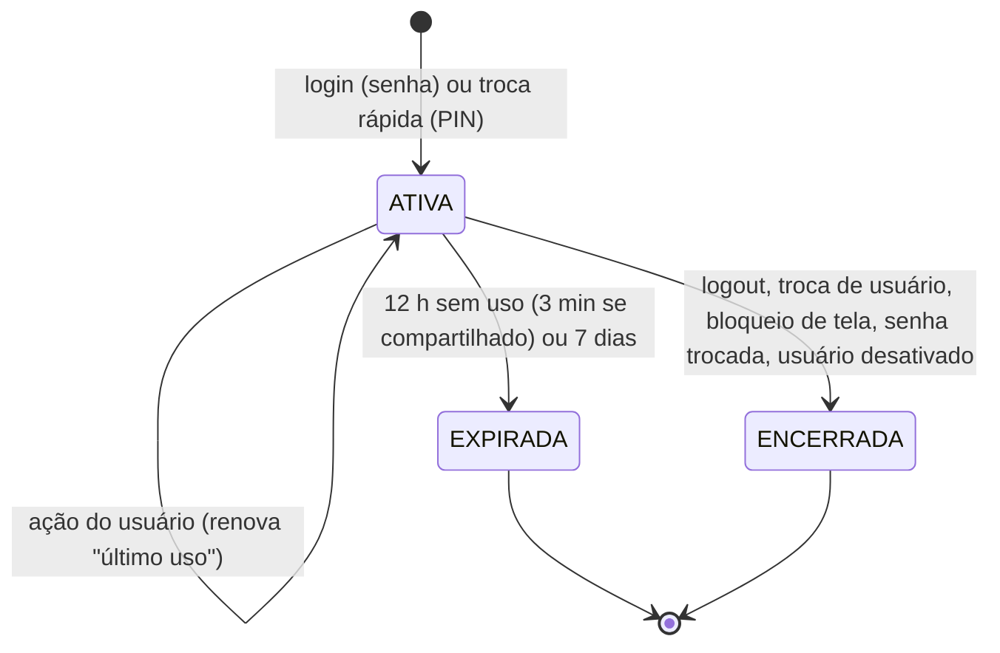

# Auth — Especificação (SDD)

> Status: Aprovado — Etapa: 2 — Responsável: domain-spec
> Decisões: ADR-0002, Q-12, E2-2, E2-3, E2-4, E2-5, E2-7

## 1. Objetivo
Garantir que só pessoas cadastradas usem o sistema, cada uma com sua própria sessão, e permitir
que garçons troquem de usuário em segundos num aparelho compartilhado, sem perder rastreabilidade.

## 2. Atores
Qualquer usuário ativo (ADMIN, GERENTE, CAIXA, GARCOM, COZINHA). Sistema (expiração).

## 3. Regras de negócio
- **RN-AUTH-01** — Login por **usuário** (único no sistema, sem diferenciar maiúsculas) e **senha**. Não há e-mail nem cadastro público.
- **RN-AUTH-02** — Senhas e PINs são guardados apenas como hash **Argon2id** (irreversível). Nunca em texto.
- **RN-AUTH-03** — Mensagem de erro de login é sempre a mesma ("Usuário ou senha inválidos."), exista o usuário ou não, esteja desativado ou não — para não revelar quem existe.
- **RN-AUTH-04** — Limite de tentativas: **5 falhas em 15 min** para o mesmo usuário ou **30 falhas em 15 min** do mesmo IP bloqueiam novas tentativas até a janela terminar.
- **RN-AUTH-05** — Sessão: token aleatório de 256 bits no cookie (`HttpOnly`, `SameSite=Lax`, `Secure` em HTTPS); no banco fica só o hash SHA-256 do token.
- **RN-AUTH-06** — A sessão expira após **12 h sem uso** e, no máximo, **7 dias** após o login (Q-12). Em **aparelho compartilhado**, expira após **3 min sem uso** (E2-3).
- **RN-AUTH-07** — Sessões podem ser encerradas pelo servidor a qualquer momento (logout, desativação do usuário, troca/redefinição de senha).
- **RN-AUTH-08** — Senha: mínimo 8 e máximo 128 caracteres, diferente do nome de usuário e fora da lista de senhas óbvias.
- **RN-AUTH-09** — Senha criada ou redefinida pelo gerente é **provisória**: no primeiro acesso o usuário é obrigado a trocá-la; até lá, nenhuma outra ação é permitida.
- **RN-AUTH-10** — PIN: exatamente **6 dígitos**, não pode ter todos os dígitos iguais nem ser sequência (123456, 654321). Definir/alterar o PIN exige a senha atual.
- **RN-AUTH-11** — **Troca rápida (aparelho compartilhado):** a tela "Quem está usando?" mostra apenas usuários que entraram **com senha** naquele aparelho nos últimos **7 dias**, estão ativos e têm PIN. O usuário toca no nome e digita o PIN. A troca encerra a sessão anterior daquele aparelho.
- **RN-AUTH-12** — **5 PINs errados** seguidos travam o PIN; o usuário precisa entrar com a senha, o que destrava.
- **RN-AUTH-13** — O aparelho é identificado por um cookie próprio de longa duração (token aleatório, hash no banco). "Aparelho compartilhado" é marcado no login.
- **RN-AUTH-14** — Ao entrar, a sessão fica na loja a que o usuário tem acesso (a primeira em ordem alfabética, se houver várias; a troca de loja é da Etapa 3). Sem acesso a nenhuma loja, o login é recusado **depois** de a senha ser conferida.
- **RN-AUTH-15** — Consultas automáticas (polling, a partir da Etapa 6) **não** renovam o tempo de uso da sessão; só ações do usuário renovam.

## 4. Entidades
`app_user` (credenciais — tabela do módulo Users), `user_session`, `known_device`, `device_user`,
`rate_limit_bucket`. Ver `docs/database/modelo-de-dados.md` e `maps/database/erd.md`.

## 5. Estados da sessão

## 6. Fluxos
1. **Login:** limite de tentativas → confere senha (tempo constante mesmo se o usuário não existe) → verifica loja → cria sessão e cookie → registra o usuário no aparelho → audita `LOGIN`. Falha audita `LOGIN_FAILED`.
2. **Troca rápida:** lista usuários do aparelho → usuário escolhe e digita PIN → encerra a sessão anterior do aparelho → cria nova sessão → audita `LOGIN` (método PIN).
3. **Bloqueio por inatividade (compartilhado):** após 3 min sem uso a tela volta para "Quem está usando?" e a sessão é encerrada no servidor.
4. **Logout:** encerra a sessão, apaga o cookie, audita `LOGOUT`.

## 7. Exceções
| Situação | Código | HTTP | Mensagem |
|---|---|---|---|
| Usuário/senha errados, usuário inexistente ou desativado | `INVALID_CREDENTIALS` | 401 | Usuário ou senha inválidos. |
| Muitas tentativas | `RATE_LIMITED` | 429 | Muitas tentativas. Aguarde alguns minutos e tente de novo. |
| Sem acesso a loja | `NO_STORE_ACCESS` | 403 | Seu usuário não tem acesso a nenhuma loja. Fale com o gerente. |
| Sem sessão / sessão expirada | `UNAUTHENTICATED` / `SESSION_EXPIRED` | 401 | Sua sessão terminou. Entre novamente. |
| Precisa trocar a senha | `PASSWORD_CHANGE_REQUIRED` | 403 | Troque sua senha provisória para continuar. |
| Senha fraca | `WEAK_PASSWORD` | 400 | (motivo específico) |
| Senha atual errada | `CURRENT_PASSWORD_INVALID` | 400 | A senha atual está incorreta. |
| PIN com formato inválido | `INVALID_PIN_FORMAT` | 400 | O PIN deve ter 6 dígitos, sem sequências nem números repetidos. |
| PIN errado | `INVALID_PIN` | 401 | PIN incorreto. |
| PIN travado | `PIN_LOCKED` | 403 | PIN bloqueado após 5 tentativas. Entre com sua senha. |
| Usuário não autorizado neste aparelho | `DEVICE_USER_NOT_ALLOWED` | 403 | Entre com sua senha neste aparelho primeiro. |

## 8. Permissões
Login, troca rápida, logout, trocar a própria senha e definir o próprio PIN não exigem permissão
(exigem estar autenticado, exceto login/troca rápida).

## 9. Contratos (Server Actions)
| Ação | Entrada (Zod) | Saída | Erros | Auditoria |
|---|---|---|---|---|
| `auth.login` | `{ username, password, sharedDevice: boolean }` | redireciona para `/inicio` ou `/trocar-senha` | INVALID_CREDENTIALS, RATE_LIMITED, NO_STORE_ACCESS | LOGIN / LOGIN_FAILED |
| `auth.switchUser` | `{ userId, pin }` | redireciona para `/inicio` | INVALID_PIN, PIN_LOCKED, DEVICE_USER_NOT_ALLOWED, NO_STORE_ACCESS | LOGIN / LOGIN_FAILED |
| `auth.logout` | — | redireciona para `/login` | — | LOGOUT |
| `auth.lockScreen` | — | redireciona para `/quem-esta-usando` | — | LOGOUT (motivo bloqueio) |
| `auth.changePassword` | `{ currentPassword, newPassword }` | ok | CURRENT_PASSWORD_INVALID, WEAK_PASSWORD | USER_UPDATED (sem dados da senha) |
| `auth.setPin` | `{ currentPassword, pin }` | ok | CURRENT_PASSWORD_INVALID, INVALID_PIN_FORMAT | USER_UPDATED |

Idempotência: não se aplica (login cria sessão nova a cada tentativa; reenvio gera outra sessão válida).

## 10. Critérios de aceite
- **CA-AUTH-01** — Login com senha correta cria sessão e leva à tela inicial → `tests/features/auth/login.feature`
- **CA-AUTH-02** — Senha errada e usuário inexistente têm a mesma mensagem → `login.feature`
- **CA-AUTH-03** — 5 falhas bloqueiam o usuário por 15 min → `login.feature`
- **CA-AUTH-04** — Sessão expira após 12 h sem uso e após 7 dias → `sessao.feature`
- **CA-AUTH-05** — Senha provisória obriga troca → `login.feature`
- **CA-AUTH-06** — Troca rápida com PIN só para quem já entrou com senha no aparelho → `troca-rapida.feature`
- **CA-AUTH-07** — 5 PINs errados travam o PIN → `troca-rapida.feature`
- **CA-AUTH-08** — Aparelho compartilhado bloqueia após 3 min sem uso → `troca-rapida.feature` + E2E
- **CA-AUTH-09** — Desativar usuário encerra suas sessões → `sessao.feature`

## 11. Dependências
Users (credenciais), Authorization (lojas acessíveis), Audit, Organizations (loja).

## 12. Testes previstos
Unit (políticas de senha, PIN e expiração), integração com MySQL (todos os fluxos, limite de
tentativas, travamento de PIN), BDD em português, E2E (login, troca rápida, bloqueio por inatividade).

## 13. Fora do escopo
Recuperação de senha por e-mail/SMS, login social, 2FA, troca de loja (Etapa 3).
