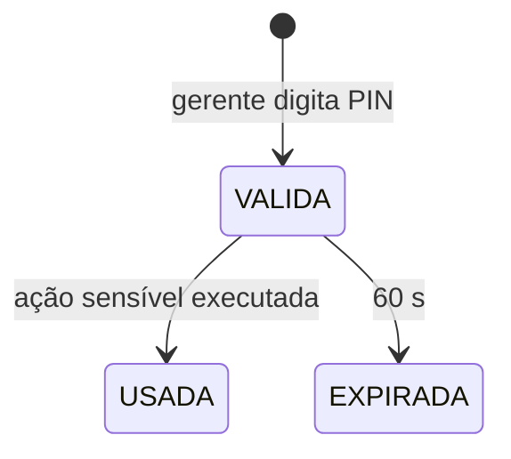

# Authorization — Especificação (SDD)

> Status: Aprovado — Etapa: 2 — Responsável: domain-spec
> Decisões: README B.7.1, ADR-0009, E2-4

## 1. Objetivo
Decidir, **no servidor**, o que cada pessoa pode fazer em cada loja, e permitir que um gerente
autorize na hora uma ação sensível no aparelho de outra pessoa.

## 2. Atores
Todos os perfis; GERENTE/ADMIN como autorizadores.

## 3. Regras de negócio
- **RN-AUTHZ-01** — Modelo `Perfil → Permissões (recurso.ação) → Escopo (organização | empresa | loja)`. Um usuário pode ter perfis diferentes em lojas diferentes.
- **RN-AUTHZ-02** — Permissões efetivas na loja ativa = união das permissões de todos os perfis do usuário cujo escopo cobre a loja (a própria loja, a empresa dela ou a organização).
- **RN-AUTHZ-03** — Toda ação de negócio verifica a permissão **no caso de uso**, no servidor. A tela só esconde botões por conveniência.
- **RN-AUTHZ-04** — Perfis de sistema: ADMIN, GERENTE, CAIXA, GARCOM, COZINHA (matriz em `maps/permissions/matriz-rbac.md`). Perfis futuros entram como dados, sem mudar estrutura.
- **RN-AUTHZ-05** — **Anti-escalada:** só se atribui um perfil se quem atribui possuir, na mesma loja, **todas** as permissões daquele perfil; e só em lojas a que tem acesso. Ninguém altera os próprios perfis.
- **RN-AUTHZ-06** — **Autorização elevada:** quando falta uma permissão, outro usuário que a possui (na mesma loja) digita **usuário + PIN** no aparelho atual. Isso gera uma autorização de **uso único**, válida por **60 s**, presa à sessão de quem pediu e à permissão pedida.
- **RN-AUTHZ-07** — A autorização elevada é auditada (`ELEVATED_AUTH_GRANTED`) com quem pediu e quem autorizou. PINs errados contam para o travamento de PIN do autorizador (RN-AUTH-12).
- **RN-AUTHZ-09** — *Quem age está acima do alvo* (revisão da Etapa 2): para renomear, trocar perfis, redefinir senha ou desativar alguém, quem age precisa ter — num escopo que inclui cada perfil do alvo (outra loja, empresa ou organização) — todas as permissões daquele perfil. Gerente de loja não mexe no ADMIN da organização nem em quem é gerente em outra loja (`USER_MANAGEMENT_NOT_ALLOWED`).
- **RN-AUTHZ-10** — Na autorização do gerente, usuário inexistente, de outra organização e PIN errado recebem a MESMA resposta (`INVALID_AUTHORIZATION`) e a mesma demora; falhas vão para a auditoria. Autorizador com senha provisória não autoriza.
- **RN-AUTHZ-08** — Limite de desconto por perfil (`max_discount_bp`): ADMIN/GERENTE 100%, CAIXA 10%, GARCOM 0%, COZINHA 0% (Q-07). Na loja vale o MAIOR limite entre os perfis que a cobrem (`getDiscountLimitInStore` — Etapa 8); acima dele, `discounts.apply_above_limit` ou PIN do gerente (RN-POS-05).

## 4. Entidades
`role`, `permission`, `role_permission`, `user_role_assignment`, `elevated_grant`.

## 5. Estados da autorização elevada

## 7. Exceções
| Situação | Código | HTTP | Mensagem |
|---|---|---|---|
| Sem permissão | `FORBIDDEN` | 403 | Você não tem permissão para esta ação. |
| Autorizador sem a permissão (PIN correto) ou com senha provisória | `AUTHORIZER_NOT_ALLOWED` | 403 | Este usuário não pode autorizar esta ação. |
| Autorizador inexistente, de outra organização ou PIN errado | `INVALID_AUTHORIZATION` | 401 | Usuário ou PIN do autorizador inválidos. |
| Alvo acima de quem age / em outra loja | `USER_MANAGEMENT_NOT_ALLOWED` | 403 | Você não pode alterar este usuário: ele tem perfis acima dos seus ou em outra loja. |
| Autorização usada/expirada/de outra sessão | `ELEVATED_GRANT_INVALID` | 403 | A autorização expirou ou já foi usada. Peça novamente. |
| Atribuição de perfil proibida | `ROLE_ASSIGNMENT_NOT_ALLOWED` | 403 | Você não pode atribuir este perfil. |
| Loja fora do alcance do usuário | `STORE_ACCESS_DENIED` | 403 | Você não tem acesso a esta loja. |

## 9. Contratos
| Ação | Entrada | Saída | Permissão | Auditoria |
|---|---|---|---|---|
| `authorization.requestElevation` | `{ authorizerUsername, pin, permission }` | `{ grantToken, expiresAt }` | autenticado | ELEVATED_AUTH_GRANTED |
| (interno) `authorizeOrElevate(ctx, permission, grantToken?)` | — | — | a própria ou elevada | — |

## 10. Critérios de aceite
- **CA-AUTHZ-01** — Usuário sem permissão é recusado no servidor → `tests/features/authorization/permissoes.feature`
- **CA-AUTHZ-02** — Perfil na loja A não vale na loja B → `permissoes.feature`
- **CA-AUTHZ-03** — Perfil na organização vale em todas as lojas → `permissoes.feature`
- **CA-AUTHZ-04** — Gerente autoriza com PIN; a autorização vale uma vez e por 60 s → `autorizacao-gerente.feature`
- **CA-AUTHZ-05** — Gerente não consegue atribuir ADMIN → `permissoes.feature`

## 12. Testes previstos
Unit (resolução de permissões, anti-escalada), integração (escopos, autorização elevada, isolamento A×B), BDD.
