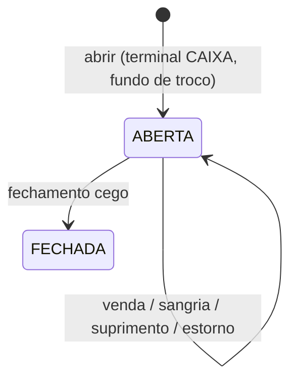

# Cashier (caixa) — Especificação (SDD)

> Status: Aprovado — Etapa: 8 — Responsável: domain-spec
> Decisões: README B.7.4, Q-05, Q-16, E8-2, E8-5 (docs/requirements/perguntas-abertas.md),
> ADR-0003 (dinheiro), ADR-0008 (transações), ADR-0009 (isolamento), ADR-0013 (dia operacional)

## 1. Objetivo
Controlar o dinheiro de cada caixa: abertura com fundo de troco, sangrias e suprimentos, as vendas
recebidas no PDV e o **fechamento cego** — o operador conta e informa o que tem, sem ver o esperado,
e o sistema grava esperado, informado e diferença.

## 2. Atores
CAIXA, GERENTE, ADMIN (`cashier.*`). O garçom não usa o caixa.

## 3. Regras de negócio
- **RN-CASH-01** — Tudo na **loja ativa** (ADR-0009). Sessão de outra loja: "não encontrada".
- **RN-CASH-02** — **Abrir** (`cashier.open`): só num aparelho vinculado a um **terminal do tipo
  CAIXA, ativo**, da loja (E8-2; vínculo da Etapa 3) — senão `TERMINAL_REQUIRED`. Um caixa aberto
  **por terminal** (índice único na coluna gerada `open_terminal_id`) — senão `CASH_ALREADY_OPEN`.
  No máximo `max_open_cash_sessions` caixas abertos na loja (Q-05) — senão `CASH_LIMIT_REACHED`.
  Fundo de troco de R$ 0,00 a R$ 100.000,00. Grava quem abriu, quando, o terminal e o **dia
  operacional** (ADR-0013). Idempotente (chave do cliente).
- **RN-CASH-03** — **Sangria** e **suprimento** (`cashier.movement`): valor > 0, motivo de 3 a 200
  caracteres, no caixa aberto **deste terminal**. Sangria maior que o dinheiro esperado na gaveta é
  **aceita** (decisão I-3 da revisão, 2026-10-05): recusar deixaria o operador descobrir o esperado
  por tentativa e o fechamento deixaria de ser cego. Ela fica marcada na auditoria
  (`aboveExpected`) e, **depois do fechamento**, a conferência aponta ao gerente as sangrias que
  levaram o dinheiro da gaveta abaixo de zero.
- **RN-CASH-04** — **Vendas**: cada pagamento do PDV gera uma movimentação `VENDA` (forma de pagamento,
  valor) no caixa aberto do terminal, na mesma transação (docs/modules/pos.md). Cancelar o pagamento
  gera `ESTORNO` (valor negativo) no **mesmo** caixa, que precisa estar aberto.
- **RN-CASH-05** — **Esperado por forma de pagamento**: dinheiro = fundo + vendas em dinheiro +
  suprimentos − sangrias − estornos em dinheiro; demais formas = vendas − estornos daquela forma.
- **RN-CASH-06** — **Fechamento cego** (`cashier.close`): o operador informa o **dinheiro**
  (obrigatório) e, se quiser, cartão de crédito, débito, PIX e outro (Q-16). O sistema grava, por
  forma, esperado, informado e diferença (informado − esperado); forma não informada fica sem
  diferença. Só **depois** de fechar a tela mostra as diferenças. Antes do fechamento, a tela do
  caixa **não mostra totais de venda nem o esperado do dinheiro** (é isso que torna o fechamento
  "cego").
- **RN-CASH-06a** — **Fechamento mais fácil** (E10-6, 2026-10-05), sem abrir o esperado do dinheiro:
  (A) **contador de cédulas e moedas** na tela, que soma e preenche o dinheiro; (B) **PIX, cartões e
  outro** mostram o valor do sistema antes de fechar, para conferir com a maquininha e o extrato
  (não revelam o dinheiro: o total de vendas continua escondido); (C) se o dinheiro informado não
  bater, o sistema guarda essa **primeira contagem** (`cash_session.first_cash_count_cents`),
  **não fecha** e pede para contar de novo **sem dizer o valor** (evento `CASH_RECOUNT_REQUESTED`);
  na segunda vez o caixa fecha, bata ou não. Só **uma** recontagem por caixa (várias deixariam
  descobrir o esperado por tentativa e erro). O gerente vê as duas contagens no fechamento e no
  relatório de caixa; a tela do caixa nunca recebe a primeira contagem.
- **RN-CASH-07** — O caixa pode ser fechado com contas ainda abertas (E8-5): elas continuam abertas
  e são recebidas em outro caixa ou no dia seguinte. Caixa fechado não recebe mais nada.
- **RN-CASH-08** — Concorrência: abrir, movimentar, receber e fechar travam a linha da sessão; quem
  espera relê com trava — inclusive a SOMA das movimentações que dá o esperado (achado B-2 da
  revisão: duas sangrias simultâneas deixavam a gaveta negativa). Receber enquanto outro fecha: um dos dois vence; o pagamento num caixa já
  fechado é recusado (`CASH_SESSION_CLOSED`). Fechar usa a versão lida (`CONCURRENT_MODIFICATION`).
- **RN-CASH-09** — Auditoria: `CASH_OPENED`, `CASH_MOVEMENT` (sangria/suprimento), `CASH_CLOSED`
  (com esperado, informado e diferença).

## 4. Entidades
| Entidade | Atributos | Invariantes |
|---|---|---|
| CashSession | store, terminal, status (`ABERTA`, `FECHADA`), operational_date, opened_by/at, opening_amount, closed_by/at, version | uma ABERTA por terminal |
| CashMovement | session, type (`VENDA`, `SANGRIA`, `SUPRIMENTO`, `AJUSTE`, `ESTORNO`), payment_method, amount (com sinal), payment?, reason?, user, authorized_by?, occurred_at | imutável |
| CashSessionCount | session, payment_method, expected, declared?, difference? | uma por forma |

## 5. Estados

## 6. Exceções
| Situação | Código | HTTP | Mensagem |
|---|---|---|---|
| Aparelho sem terminal de caixa | `TERMINAL_REQUIRED` | 422 | Este aparelho não é um terminal de caixa. Peça ao gerente para vinculá-lo em Administração → Terminais. |
| Já há caixa aberto neste terminal | `CASH_ALREADY_OPEN` | 409 | Já existe um caixa aberto neste terminal. |
| Limite de caixas abertos | `CASH_LIMIT_REACHED` | 422 | A loja já tem o número máximo de caixas abertos. |
| Nenhum caixa aberto neste terminal | `CASH_NOT_OPEN` | 422 | Abra o caixa deste terminal antes. |
| Caixa fechado no meio da operação | `CASH_SESSION_CLOSED` | 409 | Este caixa foi fechado. |
| Valor inválido | `INVALID_CASH_AMOUNT` | 400 | Informe um valor válido (ex.: 150,00). |
| Motivo obrigatório | `CASH_REASON_REQUIRED` | 400 | Explique o motivo (3 a 200 caracteres). |
| Dinheiro não informado no fechamento | `CASH_COUNT_REQUIRED` | 400 | Informe quanto há em dinheiro na gaveta. |
| Outra pessoa alterou antes | `CONCURRENT_MODIFICATION` | 409 | Outra pessoa alterou este caixa. Recarregue a página. |

## 7. Permissões
| Ação | Permissão |
|---|---|
| Ver o caixa | `cashier.read` |
| Abrir | `cashier.open` |
| Sangria, suprimento | `cashier.movement` |
| Fechar | `cashier.close` |

## 8. Contratos
| Ação | Entrada | Saída | Auditoria |
|---|---|---|---|
| `cashier.current` | — | caixa aberto do terminal (sem totais de venda) ou null | — |
| `cashier.open` | `{ openingAmount, idempotencyKey }` | `{ sessionId }` | `CASH_OPENED` |
| `cashier.movement` | `{ type: SANGRIA \| SUPRIMENTO, amount, reason, idempotencyKey }` | ok | `CASH_MOVEMENT` |
| `cashier.close` | `{ sessionId, version, declared: { DINHEIRO, PIX?, ... }, idempotencyKey }` | contagem por forma (esperado, informado, diferença) | `CASH_CLOSED` |
| Público (POS, na transação) | `lockOpenSession(tx, ctx)`, `recordSale`, `recordRefund(sessionId…)` | — | — |

## 9. Modelo de dados (migration 0011)
`cash_session` (UQ `open_terminal_id` gerada; IX (store_id, operational_date); CK fundo ≥ 0),
`cash_movement` (IX (cash_session_id, type); IX payment_id), `cash_session_count`
(PK (cash_session_id, payment_method)).

## 10. Critérios de aceite
- **CA-CASH-01** — Abre no terminal de caixa; aparelho sem terminal é recusado → `tests/features/cashier/caixa.feature`
- **CA-CASH-02** — Sangria e suprimento com motivo; sangria acima do dinheiro é recusada → `caixa.feature`
- **CA-CASH-03** — Fechamento cego grava esperado, informado e diferença → `caixa.feature`
- **CA-CASH-04** — Garçom não abre caixa; outra loja não vê nem fecha o caixa → `caixa.feature`, `tests/integration/modules/cashier/cashier-rules.test.ts`
- **CA-CASH-05** — Duas sangrias ao mesmo tempo; sangria × estorno → `cashier-rules.test.ts`; receber × fechar e dois abrindo no mesmo terminal → `tests/integration/modules/pos/pos-rules.test.ts`

## 11. Dependências
Organizations (terminal do aparelho, limite de caixas, fuso e virada), Users (nomes), Audit.
POS usa a API pública na transação. Cashier não depende de POS nem de Orders.

## 12. Fora do escopo
Ajuste manual de caixa (o tipo `AJUSTE` existe no banco), reabrir caixa fechado, relatório de caixa
(Etapa 9), integração com TEF/PSP.
