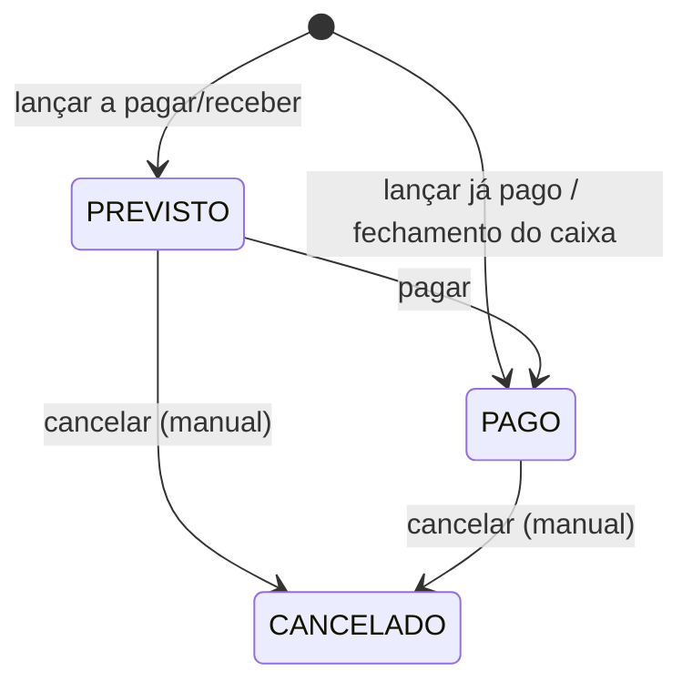

# Finance (financeiro básico) — Especificação (SDD)

> Status: Aprovado — Etapa: 9 — Responsável: domain-spec
> Decisões: README B.7.6, E9-2, E9-3 (docs/requirements/perguntas-abertas.md), ADR-0003 (dinheiro),
> ADR-0008 (transações), ADR-0009 (isolamento), ADR-0013 (dia operacional)

## 1. Objetivo
Saber quanto entrou e quanto saiu: as vendas entram sozinhas quando o caixa fecha; o gerente lança
despesas (pagas ou a pagar) e outras receitas, e vê um fluxo de caixa simples por dia.

## 2. Atores
GERENTE e ADMIN (`finance.read`, `finance.manage` — E9-3). Caixa e garçom não veem o financeiro.

## 3. Regras de negócio
- **RN-FIN-01** — Lançamentos são da **loja ativa** (ADR-0009); categorias são da **empresa**.
  Lançamento ou categoria de outra loja/empresa = "não encontrado".
- **RN-FIN-02** — **Categorias** (E9-2): RECEITA ou DESPESA, nome de 2 a 60 caracteres, único na
  empresa por tipo (sem diferenciar maiúsculas). Iniciais, criadas na primeira vez que a empresa usa o
  financeiro: Vendas (receita do sistema, só automática), Outras receitas; Insumos e fornecedores,
  Salários, Aluguel, Contas de consumo, Impostos e taxas, Manutenção, Outros. Categoria é desativada,
  nunca apagada; "Vendas" não é desativada nem usada em lançamento manual.
- **RN-FIN-03** — **Receita das vendas** (README B.7.6): ao **fechar o caixa**, na mesma transação, uma
  receita por forma de pagamento com o total **líquido** do caixa naquela forma (vendas − estornos),
  categoria Vendas, situação PAGO, competência e pagamento = dia operacional do caixa, origem CAIXA.
  Forma com total zero não gera lançamento. Uma por (caixa, forma) — índice único; o fechamento é
  idempotente (Etapa 8), então a receita nunca dobra. Lançamento automático não é cancelado à mão.
- **RN-FIN-04** — **Lançamento manual** (`finance.manage`): tipo, categoria ativa do mesmo tipo,
  descrição de 3 a 120 caracteres, valor de R$ 0,01 a R$ 10.000.000,00, dia de competência. Situação:
  **PAGO** (com dia do pagamento) ou **PREVISTO** (com vencimento). Datas de 2000-01-01 até um ano
  à frente. Idempotente (chave do cliente). Auditoria `FINANCE_ENTRY_CREATED`.
- **RN-FIN-05** — **Pagar** um lançamento PREVISTO: informa o dia do pagamento → PAGO. Já pago:
  nada muda. Auditoria `FINANCE_ENTRY_PAID`. Versão lida (`CONCURRENT_MODIFICATION`).
- **RN-FIN-06** — **Cancelar** lançamento manual (PREVISTO ou PAGO) com motivo de 3 a 200 caracteres →
  CANCELADO (continua guardado). Auditoria `FINANCE_ENTRY_CANCELLED`. Para corrigir um valor,
  cancela-se e lança-se de novo.
- **RN-FIN-07** — **Fluxo de caixa simplificado** (período de até 366 dias): por dia de pagamento,
  entradas e saídas PAGAS, saldo do dia e saldo acumulado no período; à parte, as despesas e receitas
  PREVISTAS com vencimento nos próximos 30 dias (e as vencidas, destacadas).
- **RN-FIN-08** — Lista de lançamentos com filtros (período de competência, tipo, situação,
  categoria) e paginação no servidor (50 por página).

## 4. Entidades
| Entidade | Atributos | Invariantes |
|---|---|---|
| FinanceCategory | company, type, name, system_code?, active, version | nome único por (empresa, tipo) |
| FinanceEntry | store, type, category, description, amount, competence_date, due_date?, paid_date?, status, source, cash_session?, payment_method?, created_by/at, cancelled_by/at/reason, version | PAGO ⇔ paid_date; PREVISTO ⇒ due_date; origem CAIXA ⇒ caixa e forma |

## 5. Estados

## 6. Exceções
| Situação | Código | HTTP | Mensagem |
|---|---|---|---|
| Valor inválido | `INVALID_FINANCE_AMOUNT` | 400 | Informe um valor de R$ 0,01 a R$ 10.000.000,00. |
| Descrição inválida | `INVALID_FINANCE_DESCRIPTION` | 400 | Descreva o lançamento (3 a 120 caracteres). |
| Data inválida | `INVALID_FINANCE_DATE` | 400 | Informe uma data válida (até um ano à frente). |
| Categoria inexistente, inativa ou de outro tipo | `FINANCE_CATEGORY_INVALID` | 422 | Escolha uma categoria ativa do mesmo tipo. |
| Nome de categoria repetido | `FINANCE_CATEGORY_TAKEN` | 409 | Já existe uma categoria com este nome. |
| Categoria do sistema | `FINANCE_CATEGORY_SYSTEM` | 422 | A categoria Vendas é do sistema. |
| Lançamento automático | `FINANCE_ENTRY_AUTOMATIC` | 422 | Lançamento do fechamento do caixa não é alterado. |
| Já cancelado | `FINANCE_ENTRY_CANCELLED` | 422 | Este lançamento já foi cancelado. |
| Motivo obrigatório | `CANCEL_REASON_REQUIRED` | 400 | Explique o motivo (3 a 200 caracteres). |
| Lançamento de outra loja | `FINANCE_ENTRY_NOT_FOUND` | 404 | Lançamento não encontrado. |
| Período inválido | `INVALID_PERIOD` | 400 | Escolha um período de até 366 dias. |

## 7. Permissões
| Ação | Permissão |
|---|---|
| Ver lançamentos, categorias e fluxo | `finance.read` |
| Lançar, pagar, cancelar, categorias | `finance.manage` |

## 8. Contratos
| Ação | Entrada | Saída | Auditoria |
|---|---|---|---|
| `finance.entries` | `{ from, to, type?, status?, categoryId?, page }` | lançamentos + total | — |
| `finance.create` | `{ type, categoryId, description, amount, competenceDate, status, date, idempotencyKey }` | `{ id }` | `FINANCE_ENTRY_CREATED` |
| `finance.pay` | `{ entryId, version, paidDate }` | ok | `FINANCE_ENTRY_PAID` |
| `finance.cancel` | `{ entryId, version, reason }` | ok | `FINANCE_ENTRY_CANCELLED` |
| `finance.categories` / `createCategory` / `setCategoryActive` | … | … | `FINANCE_CATEGORY_CREATED/UPDATED` |
| `finance.cashFlow` | `{ from, to }` | dias + previstos | — |
| Público (Cashier, na transação) | `recordCashSales(tx, ctx, { sessionId, operationalDate, totals })` | — | — |

## 9. Modelo de dados (migration 0012)
`finance_category` (UQ (company_id, type, name); UQ (company_id, system_code)),
`finance_entry` (IX (store_id, competence_date); IX (store_id, status, due_date); IX (store_id,
paid_date); UQ (cash_session_id, payment_method); CHECKs de situação, valor e origem).

## 10. Critérios de aceite
- **CA-FIN-01** — Fechar o caixa gera uma receita por forma de pagamento → `tests/features/finance/financeiro.feature`
- **CA-FIN-02** — Despesa prevista é paga; cancelada com motivo → `financeiro.feature`
- **CA-FIN-03** — Fluxo de caixa por dia com saldo acumulado → `financeiro.feature`
- **CA-FIN-04** — Caixa não vê o financeiro; outra loja não vê lançamentos → `financeiro.feature`, `finance-rules.test.ts`

## 11. Dependências
Organizations (loja → empresa, dia operacional), Users (nomes), Audit. Cashier chama a API pública
`recordCashSales` (Finance não depende de Cashier).

## 12. Fora do escopo
DRE, DFC, conciliação e integração bancária (README B.7.6), contas a pagar recorrentes, anexos,
centros de custo.
