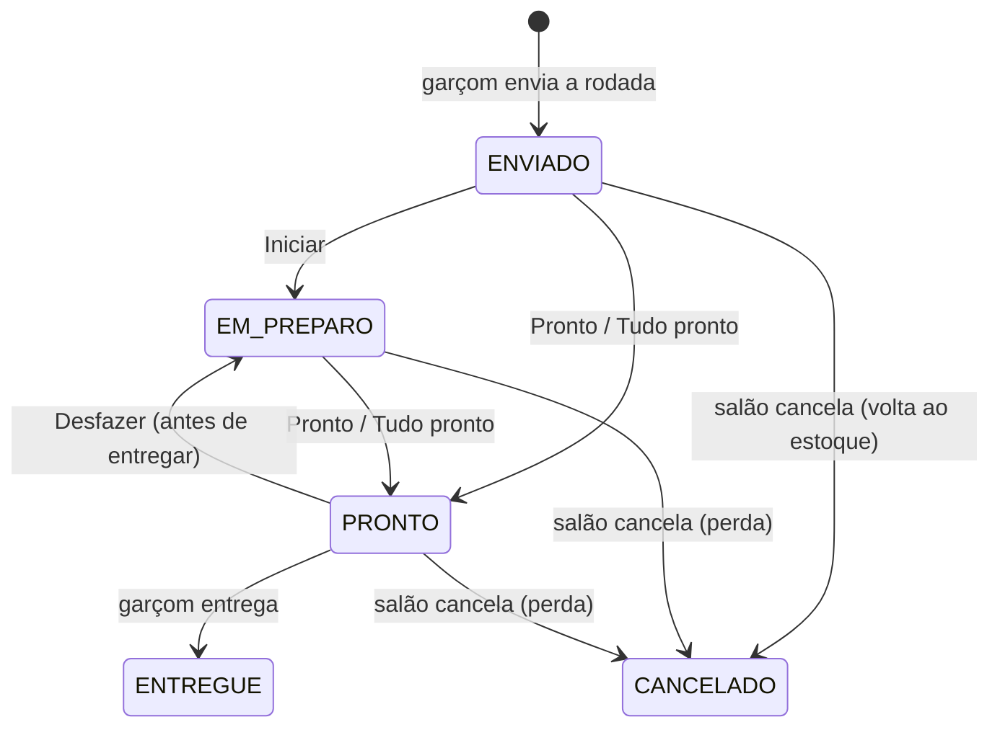
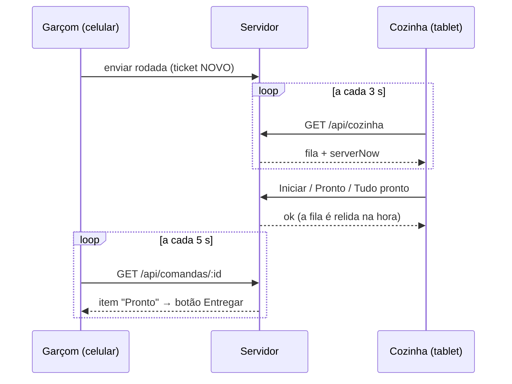

# Kitchen (KDS) — Especificação (SDD)

> Status: Aprovado — Etapa: 7 — Responsável: domain-spec
> Decisões: README B.6 (Etapa 7), Q-02 (opção A), Q-14, E7-1 a E7-4
> (docs/requirements/perguntas-abertas.md), ADR-0005 (polling), ADR-0010 (impressão),
> ADR-0009 (isolamento), maps/kitchen/fluxo-kds.md

## 1. Objetivo
A cozinha vê, num tablet deitado, os pedidos que o salão enviou, do mais antigo para o mais novo,
com um cronômetro e cores de alerta. Marca cada item como **iniciado** e **pronto** (ou o pedido
inteiro de uma vez) e o garçom vê no celular o que ficou pronto para entregar.

## 2. Atores
COZINHA, GERENTE e ADMIN (veem e marcam); GARÇOM (só vê — acompanha o preparo).

## 3. Regras de negócio
- **RN-KDS-01** — Tudo fica na **loja ativa** (ADR-0009): ticket ou item de outra loja responde "não
  encontrado". A tela mostra a **estação padrão** da loja (MVP de uma estação — Q-08); o modelo já
  guarda a estação em cada ticket e item para várias praças no futuro.
- **RN-KDS-02** — **Fila**: tickets `NOVO` e `EM_PREPARO` da estação, do **mais antigo** para o mais
  novo (hora do envio da rodada; empate pelo id). Cada ticket mostra mesa (ou "Balcão · nome"),
  número da conta, rodada, garçom que enviou, hora do envio e os itens com quantidade, adicionais e
  **observação em destaque**. Itens sem preparo (Q-08) nunca vão para a cozinha.
- **RN-KDS-03** — **Iniciar** um item (`kds.manage`): `ENVIADO → EM_PREPARO`, com hora e quem
  iniciou. Item já em preparo, pronto ou entregue: **nada muda** (outro tablet já fez — sem erro).
- **RN-KDS-04** — **Pronto** num item (`kds.manage`): `ENVIADO` ou `EM_PREPARO → PRONTO`, com hora e
  quem terminou — não precisa ter tocado em "Iniciar". Item já pronto ou entregue: nada muda.
- **RN-KDS-05** — **Tudo pronto** no ticket (`kds.manage`, Q-14): todos os itens `ENVIADO` ou
  `EM_PREPARO` do ticket ficam `PRONTO` de uma vez. Itens cancelados ou já prontos ficam como estão.
- **RN-KDS-06** — **Situação do ticket é calculada** a partir dos itens não cancelados:
  todos cancelados → `CANCELADO`; todos prontos ou entregues → `PRONTO`; todos ainda enviados →
  `NOVO`; senão → `EM_PREPARO`. O ticket guarda a hora em que começou (primeiro item iniciado ou
  pronto), em que ficou pronto e em que **saiu da fila** (`finished_at`: pronto ou cancelado). O
  cálculo vale também quando o salão cancela um item (RN-ORD-14): cancelar o único item que faltava
  deixa o ticket `PRONTO`.
- **RN-KDS-07** — **Desfazer pronto** (`kds.manage`, E7-2): item `PRONTO` volta a `EM_PREPARO` enquanto
  o garçom **não entregou** (`ENTREGUE` → `ITEM_ALREADY_DELIVERED`). O ticket volta para a fila na
  posição original. Fica na auditoria (`KITCHEN_READY_UNDONE`). Item que já não está pronto (outro
  tablet desfez): nada muda.
- **RN-KDS-08** — Item **cancelado pelo salão** não pode ser iniciado nem marcado pronto
  (`ITEM_CANCELLED`). Na tela, aparece **riscado por 30 segundos** com o motivo, para a cozinha
  perceber, e depois some; o ticket todo cancelado também fica riscado 30 s antes de sair.
  A regra de estoque é a da Etapa 5/6 (RN-ORD-13): enviado volta ao estoque; em preparo ou pronto
  vira perda.
- **RN-KDS-09** — **Cronômetro** desde o envio da rodada, calculado no aparelho com a hora do
  **servidor** (cada leitura traz `serverNow`; a tela corrige a diferença do relógio do tablet).
  Alertas (Q-14, E7-1): **"Atenção"** (amarelo) a partir de `kds_warning_minutes` (padrão **10**) e
  **"Atrasado"** (vermelho) a partir de `kds_late_minutes` (padrão **20**), configuráveis por loja
  pelo ADMIN (`stores.manage`); de 1 a 240 minutos, amarelo antes do vermelho. A cor sempre vem com
  o texto (acessibilidade).
- **RN-KDS-10** — **Prontos há pouco**: os tickets que saíram da fila como `PRONTO` nos últimos
  **15 minutos** (até 12, o mais recente primeiro), para conferir e **desfazer** um pronto por engano.
- **RN-KDS-11** — **Atualização automática** a cada **3 s** (ADR-0005), sem renovar a sessão
  (RN-AUTH-15), com pausa quando a aba está escondida. Cada leitura traz a fila completa da estação
  (ver §12 — desvio do cursor `since`).
- **RN-KDS-12** — Ações da cozinha travam a **conta** antes do item (mesma ordem do salão, RN-ORD-22)
  e releem o item com trava: dois tablets marcando o mesmo item, ou a cozinha marcando enquanto o
  garçom cancela, entram em fila e o segundo vê o resultado do primeiro. As ações da cozinha **não
  mudam a versão da conta** (a versão protege as ações do garçom sobre a conta — transferir, juntar,
  pedir a conta —, que não dependem do preparo). A cozinha marca itens mesmo de conta já fechada
  ou juntada (no balcão o cliente pode pagar antes de a comida sair — Etapa 8).
- **RN-KDS-13** — **Aviso sonoro** (E7-3) quando chega ticket novo, depois que alguém toca em
  "Ativar som" (regra do navegador). **Tela acesa** (E7-4) enquanto a tela da cozinha está aberta, se
  o navegador permitir.
- **RN-KDS-14** — **Imprimir** (Q-02 = A, ADR-0010): cada ticket tem o botão "Imprimir", que abre a
  impressão do navegador com a via da cozinha em 80 mm (mesa, conta, rodada, hora, garçom, itens,
  adicionais e observações; sem preços). A via fica montada (invisível) até o próximo "Imprimir"
  — no Android e no iPad a impressão não espera; a largura do papel vem do driver da térmica.
- **RN-KDS-15** — A leitura automática confere a **loja da tela** (`?loja=`): se a loja foi trocada
  em outra aba, responde 409 e a tela pede para recarregar, em vez de mostrar a fila de outra loja
  com o nome da antiga (vale também para o mapa do salão).

## 4. Entidades
| Entidade | Atributos | Invariantes |
|---|---|---|
| KitchenTicket (tabela do Orders) | store, order, round, station, status, created_at, started_at, ready_at, finished_at, version | um por rodada × estação; status calculado dos itens (RN-KDS-06) |
| OrderItem (do Orders) | + started_by, ready_by (quem iniciou / terminou) | só itens com preparo passam pela cozinha |
| Store (do Organizations) | + kds_warning_minutes, kds_late_minutes | 1 ≤ amarelo < vermelho ≤ 240 |

## 5. Estados e transições

| De → para | Comando | Permissão | Auditoria |
|---|---|---|---|
| ENVIADO → EM_PREPARO | `kitchen.startItem` | `kds.manage` | — (hora e pessoa ficam no item) |
| ENVIADO/EM_PREPARO → PRONTO | `kitchen.readyItem`, `kitchen.readyTicket` | `kds.manage` | — (hora e pessoa ficam no item) |
| PRONTO → EM_PREPARO | `kitchen.undoReady` | `kds.manage` | `KITCHEN_READY_UNDONE` |

Ticket: `NOVO → EM_PREPARO → PRONTO`, `PRONTO → EM_PREPARO` (desfazer), qualquer um → `CANCELADO`
(todos os itens cancelados) — sempre calculado (RN-KDS-06).

## 6. Fluxos

## 7. Exceções
| Situação | Código | HTTP | Mensagem |
|---|---|---|---|
| Item/ticket de outra loja ou inexistente | `ORDER_ITEM_NOT_FOUND` / `KITCHEN_TICKET_NOT_FOUND` | 404 | Item não encontrado. / Pedido da cozinha não encontrado. |
| Item que não passa pela cozinha (pendente ou sem preparo) | `ITEM_NOT_IN_KITCHEN` | 422 | Este item não está na cozinha. |
| Item cancelado pelo salão | `ITEM_CANCELLED` | 422 | Este item foi cancelado pelo salão. |
| Desfazer item já entregue | `ITEM_ALREADY_DELIVERED` | 422 | O garçom já entregou este item. |
| Tempos de alerta inválidos | `INVALID_KDS_ALERTS` | 400 | O alerta amarelo precisa vir antes do vermelho (de 1 a 240 minutos). |
| Sem permissão | `FORBIDDEN` | 403 | Você não tem permissão para esta ação. |
| Loja trocada em outra aba | `STORE_CHANGED` | 409 | A loja mudou em outra aba. Recarregue a página e confira antes de salvar. |

## 8. Permissões
| Ação | Permissão | Autorização elevada? |
|---|---|---|
| Ver a tela da cozinha | `kds.read` (ADMIN, GERENTE, GARÇOM, COZINHA) | não |
| Iniciar, pronto, tudo pronto, desfazer, imprimir | `kds.manage` (ADMIN, GERENTE, COZINHA) | não |
| Tempos de alerta | `stores.manage` (ADMIN — E7-1) | não |

## 9. Contratos
| Ação | Entrada | Saída | Auditoria |
|---|---|---|---|
| `GET /api/cozinha?loja=<id>` (`kitchen.board`) | loja que a tela mostra (outra → 409 `STORE_CHANGED`) | `{ serverNow, stationName, warningMinutes, lateMinutes, queue[], cancelled[], recent[] }`; cada ticket: `{ id, status, title, orderNumber, roundNumber, sentByName, createdAt, finishedAt, items[] }`; cada item: `{ id, productName, quantity, modifiers[], notes, status, statusLabel, cancelReason }` (sem preços) | — |
| `kitchen.startItem` | `{ itemId, expectedStoreId }` | `{ changed }` | — |
| `kitchen.readyItem` | `{ itemId, expectedStoreId }` | `{ changed }` | — |
| `kitchen.readyTicket` | `{ ticketId, expectedStoreId }` | `{ changed: número de itens }` | — |
| `kitchen.undoReady` | `{ itemId, expectedStoreId }` | `{ changed }` | `KITCHEN_READY_UNDONE` |
| Público do Orders (na transação): `kitchenOrders` | `listQueue`, `listFinished`, `listTicketItems`, `lockItem`, `lockTicket`, `startItems`, `readyItems`, `undoReady`, `refreshTicket` — **todas com a loja** (leituras e alterações filtram `store_id` — achado I-3); `lockItem`/`lockTicket` travam a conta antes | — | — |

## 10. Critérios de aceite
- **CA-KDS-01** — Fila em ordem de envio, com observação e sem itens sem preparo → `tests/features/kitchen/fila.feature`
- **CA-KDS-02** — Iniciar e pronto por item; o garçom vê o item pronto → `tests/features/kitchen/preparo.feature`
- **CA-KDS-03** — Tudo pronto tira o ticket da fila → `preparo.feature`
- **CA-KDS-04** — Desfazer pronto antes da entrega; depois da entrega é recusado → `preparo.feature`
- **CA-KDS-05** — Item cancelado pelo salão não é marcado; ticket todo cancelado sai da fila → `preparo.feature`
- **CA-KDS-06** — Garçom só vê; outra loja não aparece → `tests/features/kitchen/fila.feature`, `tests/integration/modules/kitchen/kitchen-rules.test.ts`
- **CA-KDS-07** — Tempos de alerta configuráveis e validados → `tests/unit/modules/organizations/rules.test.ts`, `fila.feature` (Os tempos de alerta vêm da loja), CHECK em `kitchen-rules.test.ts`
- **CA-KDS-08** — Dois tablets marcando ao mesmo tempo; cozinha e cancelamento ao mesmo tempo → `kitchen-rules.test.ts`

## 11. Dependências
Orders (API na transação — o ticket pertence ao Orders), Organizations (loja, estação padrão, tempos
de alerta), Users (nome do garçom), Audit. Orders **não** depende de Kitchen (sem ciclo).

## 12. Desvios e decisões técnicas
- **Cursor `since` do ADR-0005 adiado**: a fila de uma estação tem dezenas de tickets; a leitura
  completa custa 3 consultas por índice (`ix_kitchen_ticket_queue`, `ix_kitchen_ticket_finished`).
  Um cursor por hora pode **perder** mudanças (uma transação que grava com hora anterior e confirma
  depois da leitura) e exigiria mesclar dados no aparelho. Gatilho para rever: fila com mais de
  100 tickets ou o polling aparecer no monitoramento.

## 13. Testes previstos
Unit (transições, situação do ticket, alertas, tempos), integração com MySQL (BDD, dois tablets ao
mesmo tempo, cozinha × cancelamento, isolamento entre lojas, garçom só lê), E2E (tablet: fila,
iniciar, pronto, tudo pronto, desfazer, imprimir; celular do garçom vê "Pronto").

## 14. Fora do escopo
Várias praças (P1), roteamento por produto, impressão automática (P1 — Q-02), tempo médio de preparo
por produto (relatórios, Etapa 9), "chamar garçom" pela cozinha, tela de expedição.
