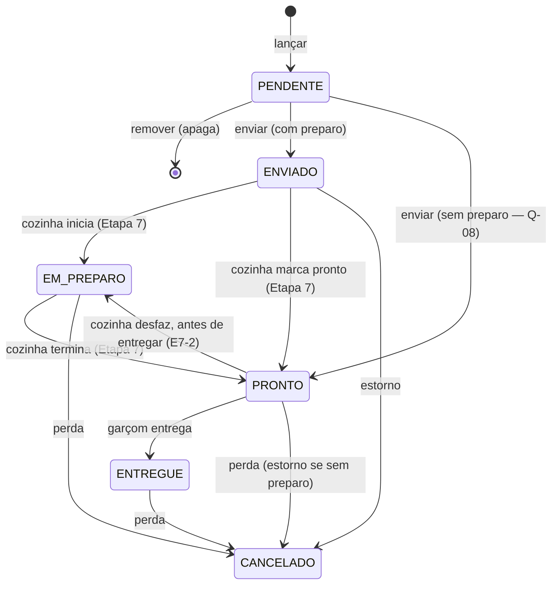

# Orders — Especificação (SDD)

> Status: Aprovado — Etapa: 6 — Responsável: domain-spec
> Decisões: README B.7.2 e B.7.3, Q-01 (ADR-0006 A), Q-04, Q-08, Q-15, Q-18, E6-1 a E6-7
> (docs/requirements/perguntas-abertas.md), ADR-0005 (polling), ADR-0007 (estoque negativo),
> ADR-0008 (transação e travas), ADR-0009 (isolamento), ADR-0012 (estado no cliente)

## 1. Objetivo
A **comanda eletrônica**: abrir a conta da mesa ou do balcão, lançar itens com adicionais e
observação, enviar as rodadas para a cozinha (com a baixa de estoque), cancelar itens com motivo e
autorização, pedir a conta, transferir, juntar e separar mesas.

## 2. Glossário
| Termo | Significado |
|---|---|
| Conta (order) | Tudo o que uma mesa (ou um cliente do balcão) consumiu. `ABERTO → FECHADO` (Etapa 8) ou `CANCELADO`. |
| Item | Uma linha da conta: produto, quantidade, adicionais, observação. Nome e preços **congelados** no lançamento. |
| Rodada | Um envio para a cozinha: os itens que estavam pendentes naquele momento. |
| Ticket de cozinha | A "via da cozinha" de uma rodada numa estação (praça). A tela do KDS (Etapa 7) é do módulo Kitchen (docs/modules/kitchen.md). |
| Balcão | Conta sem mesa, identificada por um nome livre (Q-04). |

## 3. Regras de negócio

### Escopo e abertura
- **RN-ORD-01** — Toda leitura e alteração fica na **loja ativa**. Conta, item ou mesa de outra
  loja responde "não encontrada".
- **RN-ORD-02** — **Abrir a conta da mesa** (`orders.create`): mesa ativa e `LIVRE` → conta
  `ABERTO`, tipo `MESA`, e a mesa vai para `OCUPADA`. Número de pessoas opcional, de 1 a 99 (E6-7).
  Mesa em outro estado → `TABLE_NOT_AVAILABLE`.
- **RN-ORD-03** — **Abrir conta de balcão** (`orders.create`): nome livre de 2 a 40 caracteres
  (Q-04), tipo `BALCAO`, sem mesa.
- **RN-ORD-04** — **Número da conta**: sequência por loja e **dia operacional da abertura**
  (ADR-0013), começando em 1 a cada dia. Duas aberturas simultâneas nunca recebem o mesmo número.

### Itens
- **RN-ORD-05** — **Lançar item** (`orders.create`) numa conta `ABERTO`: o produto precisa estar
  **vendável agora na loja** (ativo, com preço na loja e disponível — RN-CAT-10), senão
  `PRODUCT_NOT_AVAILABLE`. Quantidade **inteira de 1 a 99** (E6-3). Observação opcional até 140
  caracteres. Até 300 itens por conta.
- **RN-ORD-06** — **Adicionais**: só opções ativas dos grupos ligados ao produto; cada opção no
  máximo uma vez; em cada grupo, entre o mínimo e o máximo de escolhas do grupo (`INVALID_MODIFIERS`).
  O preço de cada adicional é somado ao preço unitário do item.
- **RN-ORD-07** — **Congelamento**: nome do produto, preço unitário da loja, nomes e preços dos
  adicionais são gravados no item. Mudar o cardápio, o preço ou desativar o produto depois **não
  altera** itens já lançados (README B.7.3).
- **RN-ORD-08** — Item novo fica `PENDENTE` (rascunho do garçom, salvo no servidor — ADR-0012).
  **Remover** item pendente (`orders.update`) apaga a linha; item já enviado não é removido
  (`ITEM_ALREADY_SENT`) — é cancelado (RN-ORD-12).
- **RN-ORD-09** — Lançar item numa mesa em `AGUARDANDO_CONTA` devolve a(s) mesa(s) para
  `OCUPADA` (cliente pediu mais algo), com auditoria.

### Envio para a cozinha (Q-01 = A)
- **RN-ORD-10** — **Enviar a rodada** (`orders.create`): a tela manda **os itens pendentes que
  estava mostrando** e uma chave de idempotência. Se algum não estiver mais pendente nesta conta
  (outro garçom enviou ou removeu), nada é enviado (`ITEMS_CHANGED`) e a tela recarrega. Numa
  **única transação**:
  1. cria a rodada (número sequencial na conta);
  2. itens **com preparo** → `ENVIADO`, num ticket `NOVO` da estação padrão da loja;
  3. itens **sem preparo** (refrigerante, água — Q-08) → `PRONTO` direto, sem ticket;
  4. **baixa o estoque** de todos os itens (ficha do produto + fichas dos adicionais × quantidade —
     ADR-0006): com `BLOQUEAR`, falta de insumo recusa **tudo** (`INSUFFICIENT_STOCK`, nada é
     enviado); com `PERMITIR_COM_ALERTA`, envia e devolve os avisos para o garçom;
  5. auditoria `ORDER_ROUND_SENT`.
- **RN-ORD-11** — **Reenvio** (internet caiu depois de enviar): a mesma chave devolve o resultado do
  primeiro envio, sem criar outra rodada nem baixar o estoque de novo.
- **RN-ORD-11a** — **Entregar** (`orders.update`): item `PRONTO` → `ENTREGUE`. Itens sem preparo chegam
  a `PRONTO` no envio; os demais, quando a cozinha marca pronto (RN-KDS-04, Etapa 7).

### Cancelamento de item enviado
- **RN-ORD-12** — Cancelar item `ENVIADO`, `EM_PREPARO`, `PRONTO` ou `ENTREGUE` exige
  `orders.cancel` **ou** autorização do gerente no aparelho (PIN — RN-AUTHZ-06) e **motivo** de 3 a
  200 caracteres. A auditoria `ORDER_ITEM_CANCELLED` guarda quem pediu, quem autorizou e o motivo.
- **RN-ORD-13** — Estoque do item cancelado (ADR-0006):
  - **voltou ao estoque** (estorno com o custo do consumo): item `ENVIADO` (a cozinha ainda não
    começou), ou item **sem preparo** ainda não entregue (a lata ainda está fechada);
  - **perda** (`CANCELAMENTO_APOS_PREPARO`): item em preparo, pronto ou entregue.
- **RN-ORD-14** — A situação do ticket é **calculada dos itens** (RN-KDS-06, Etapa 7): todos cancelados →
  `CANCELADO`; se o item cancelado era o único que faltava, o ticket fica `PRONTO`. Cancelar de novo →
  `ITEM_ALREADY_CANCELLED`.

### Conta e mesas
- **RN-ORD-15** — **Subtotal** (E6-1) = soma de (preço unitário + adicionais) × quantidade dos
  itens **não cancelados**, em centavos, menos o desconto de cada item (Etapa 8). A taxa de
  serviço é **congelada na abertura**: mesa = taxa da loja naquele momento, balcão = 0 (RN-POS-03).
  Desconto, taxa, pré-conta e pagamento ficam no PDV (docs/modules/pos.md); a conta guarda
  `paid_cents` e, com pagamento, **não cancela item nem junta** (`PAYMENTS_STARTED` — RN-POS-15).
- **RN-ORD-16** — **Pedir a conta** (`orders.update`): mesa(s) `OCUPADA` → `AGUARDANDO_CONTA`.
  Com itens ainda pendentes → `PENDING_ITEMS` (enviar ou remover antes).
- **RN-ORD-17** — **Transferir** (`orders.update`, Q-18): a conta inteira vai para uma mesa ativa
  e `LIVRE`; a mesa de origem fica `LIVRE`; a destino assume o estado da origem. Auditoria
  `TABLE_TRANSFERRED`.
- **RN-ORD-18** — **Juntar** (`orders.update`, Q-18): trazer a mesa B para a conta da mesa A.
  - B `LIVRE`: passa a apontar para a conta de A.
  - B com outra conta aberta: itens, rodadas (renumeradas depois das de A) e tickets vão para a
    conta de A; a conta de B é encerrada como `CANCELADO` com motivo `MESCLADA`, sem valor.
  - Depois de juntar, todas as mesas da conta ficam `OCUPADA`. Uma conta junta **até 12 mesas**
    (`ORDER_TABLE_LIMIT`) e continua com no máximo 300 itens (`ORDER_ITEM_LIMIT`) — revisão, I-1/S-1. B em `EM_PAGAMENTO` ou `LIMPEZA`
    → `TABLE_NOT_AVAILABLE`; B já na mesma conta → `SAME_ORDER`. Auditoria `ORDERS_MERGED`.
- **RN-ORD-19** — **Separar** (`orders.update`): uma mesa sai de uma conta que tem **outras**
  mesas e volta a `LIVRE` (juntou por engano; parte do grupo foi embora). A última mesa não sai
  (`ORDER_NEEDS_TABLE`). Auditoria `TABLE_DETACHED`.
- **RN-ORD-20** — **Cancelar a conta** (`orders.update`, E6-4): só se nenhum item foi enviado (todos
  pendentes ou cancelados) — os pendentes são apagados, a conta fica `CANCELADO` e as mesas `LIVRE`.
  Com itens enviados → `ORDER_HAS_SENT_ITEMS`. Motivo opcional. Auditoria `ORDER_CANCELLED`.

### Concorrência e registro
- **RN-ORD-21** — Ações sobre a conta inteira (pedir conta, transferir, juntar, separar, cancelar)
  recebem a **versão** que a tela mostrava: se outra pessoa mexeu antes, `CONCURRENT_MODIFICATION`
  e a tela recarrega. Lançar, remover, enviar, entregar e cancelar item **travam a conta** (fila) e
  incrementam a versão, sem exigir a versão da tela — dois garçons lançando na mesma mesa não se
  atrapalham. Tudo o que é lido **depois** da trava da conta (itens, rodadas, adicionais) é lido
  **com trava** também: em REPEATABLE READ uma leitura comum devolve a "foto" do início da
  transação e não veria o que o outro garçom acabou de gravar (problema encontrado nos testes de
  concorrência desta etapa — o mesmo do achado B-1 da Etapa 5).
- **RN-ORD-22** — Travas sempre na mesma ordem: conta(s) por id → mesas por id → saldo de estoque
  por insumo (evita deadlock — ADR-0008). No PDV: conta → caixa → mesas (Etapa 8). Lançar item
  trava a conta como **primeira leitura** da transação e conta os itens sem trava (deadlock por
  trava de intervalo corrigido na Etapa 7 — ADR-0008).
- **RN-ORD-23** — Toda ação que mexe na loja ativa confere a loja da tela (`STORE_CHANGED`).
- **RN-ORD-24** — Cada item guarda quem lançou e quando; envio, preparo, pronto, entrega e
  cancelamento guardam a hora (UTC) e quem fez (README B.7.3).

## 4. Entidades
| Entidade | Atributos | Invariantes |
|---|---|---|
| Order (`customer_order`) | store, number, opened_date, type, status, label?, guests?, opened_by/at, closed_by/at, cancel_reason?, merged_into?, version | número único por (loja, dia de abertura); balcão tem nome |
| OrderRound | order, number, sent_by, sent_at | número único na conta |
| OrderItem | order, round?, product, product_name, unit_price, modifiers_total, quantity, notes?, requires_preparation, status, station?, kitchen_ticket?, created_by/at, sent_at, started_at/by, ready_at/by, delivered_at, cancelled_at/by, cancel_authorized_by, cancel_reason, stock_consumed | quantidade 1–99; round ⇔ enviado |
| OrderItemModifier | item, modifier, name, price_delta | congelado |
| KitchenTicket | order, round, station, status (`NOVO`, `EM_PREPARO`, `PRONTO`, `CANCELADO` — calculado), created_at, started_at, ready_at, finished_at, version | único por (rodada, estação) |

## 5. Estados do item

## 6. Exceções
| Situação | Código | HTTP | Mensagem |
|---|---|---|---|
| Conta/item/mesa de outra loja ou inexistente | `ORDER_NOT_FOUND` / `ORDER_ITEM_NOT_FOUND` / `TABLE_NOT_FOUND` | 404 | … não encontrada. |
| Mesa não está livre | `TABLE_NOT_AVAILABLE` | 422 | Esta mesa não está livre. Recarregue o mapa. |
| Nome do balcão inválido | `INVALID_COUNTER_LABEL` | 400 | Informe um nome de 2 a 40 caracteres. |
| Pessoas inválidas | `INVALID_GUESTS` | 400 | Informe de 1 a 99 pessoas. |
| Conta não está aberta | `ORDER_NOT_OPEN` | 422 | Esta conta não está mais aberta. |
| Produto não vendável | `PRODUCT_NOT_AVAILABLE` | 422 | Este produto não está à venda agora nesta loja. |
| Quantidade inválida | `INVALID_ITEM_QUANTITY` | 400 | Informe uma quantidade de 1 a 99. |
| Observação longa | `INVALID_ITEM_NOTES` | 400 | A observação tem até 140 caracteres. |
| Adicionais inválidos | `INVALID_MODIFIERS` | 400 | Confira os adicionais: {grupo} pede de {mín} a {máx} escolhas. |
| Conta cheia | `ORDER_ITEM_LIMIT` | 422 | Esta conta chegou a 300 itens. |
| Item já enviado (remover) | `ITEM_ALREADY_SENT` | 422 | Este item já foi para a cozinha: cancele com motivo. |
| Nada a enviar | `NOTHING_TO_SEND` | 422 | Não há itens pendentes para enviar. |
| Itens mudaram (outro garçom) | `ITEMS_CHANGED` | 409 | Os itens da conta mudaram. Confira e envie de novo. |
| Falta de estoque com BLOQUEAR | `INSUFFICIENT_STOCK` | 422 | Estoque insuficiente: … |
| Item não está pronto (entregar) | `ITEM_NOT_READY` | 422 | Este item ainda não está pronto. |
| Motivo faltando | `CANCEL_REASON_REQUIRED` | 400 | Explique o motivo (3 a 200 caracteres). |
| Item já cancelado | `ITEM_ALREADY_CANCELLED` | 422 | Este item já foi cancelado. |
| Sem permissão (pode pedir o gerente) | `FORBIDDEN` (`elevationAllowed`) | 403 | Você não tem permissão para esta ação. |
| Autorização vencida/usada | `ELEVATED_GRANT_INVALID` | 403 | A autorização expirou ou já foi usada. Peça novamente. |
| Pedir conta com pendentes | `PENDING_ITEMS` | 422 | Envie ou remova os itens ainda não enviados. |
| Ação só para mesa | `NOT_A_TABLE_ORDER` | 422 | Esta ação vale só para conta de mesa. |
| Juntar mesa já na conta | `SAME_ORDER` | 422 | Esta mesa já está nesta conta. |
| Mais de 12 mesas na conta | `ORDER_TABLE_LIMIT` | 422 | Uma conta pode juntar até 12 mesas. |
| Separar a última mesa | `ORDER_NEEDS_TABLE` | 422 | A conta precisa ficar com pelo menos uma mesa. |
| Cancelar conta com itens enviados | `ORDER_HAS_SENT_ITEMS` | 422 | Cancele os itens enviados antes de cancelar a conta. |
| Outra pessoa alterou antes | `CONCURRENT_MODIFICATION` | 409 | Outra pessoa alterou esta conta. A tela foi atualizada; confira e tente de novo. |
| Loja trocada em outra aba | `STORE_CHANGED` | 409 | A loja mudou em outra aba. Recarregue a página e confira antes de salvar. |
| Chave de envio reaproveitada | `IDEMPOTENCY_KEY_REUSED` | 409 | Esta chave já foi usada em outra operação. Recarregue a tela e tente novamente. |

## 7. Permissões
| Ação | Permissão |
|---|---|
| Ver mapa e comandas | `tables.read` + `orders.read` |
| Abrir conta, lançar, enviar | `orders.create` |
| Remover pendente, entregar, pedir conta, transferir, juntar, separar, cancelar conta vazia | `orders.update` |
| Cancelar item enviado | `orders.cancel` (ADMIN, GERENTE) ou autorização do gerente (GARÇOM, CAIXA ⚡) |

## 8. Contratos
| Ação | Entrada | Saída | Auditoria |
|---|---|---|---|
| `orders.floor` | — | mesas ativas com estado e resumo da conta + contas de balcão abertas | — |
| `orders.get` | `orderId` | conta, mesas, itens por rodada, pendentes, subtotal, versão | — |
| `orders.menu` | — | cardápio vendável da loja (categorias, produtos, grupos de adicionais) | — |
| `orders.openTable` | `{ tableId, guests? }` | `{ orderId }` | `ORDER_OPENED` |
| `orders.openCounter` | `{ label }` | `{ orderId }` | `ORDER_OPENED` |
| `orders.addItem` | `{ orderId, productId, quantity, modifierIds[], notes? }` | `{ itemId }` | `TABLE_STATUS_CHANGED` se reabriu a mesa |
| `orders.removeItem` | `{ itemId }` | ok | — |
| `orders.sendRound` | `{ orderId, itemIds[], idempotencyKey }` | `{ roundNumber, sent, ready, warnings[] }` | `ORDER_ROUND_SENT` |
| `orders.deliverItem` | `{ itemId }` | ok | — |
| `orders.cancelItem` | `{ itemId, reason, grantToken? }` | ok | `ORDER_ITEM_CANCELLED` |
| `orders.requestBill` | `{ orderId, version }` | ok | `TABLE_STATUS_CHANGED` |
| `orders.transfer` | `{ orderId, version, fromTableId, toTableId }` | ok | `TABLE_TRANSFERRED` |
| `orders.join` | `{ orderId, version, tableId }` | ok | `ORDERS_MERGED` |
| `orders.detach` | `{ orderId, version, tableId }` | ok | `TABLE_DETACHED` |
| `orders.cancelOrder` | `{ orderId, version, reason? }` | ok | `ORDER_CANCELLED` |
| Leitura automática | `GET /api/salao`, `GET /api/comandas/{id}` (polling 5 s, sem renovar a sessão — RN-AUTH-15) | JSON | — |

## 9. Modelo de dados (migration 0008)
- `store_sequence` (store_id, name, operational_date, last_value) — PK (store_id, name,
  operational_date): numeração da conta por dia (E3-5), incrementada com trava da linha.
- `customer_order` (id, store_id, number, opened_date, type ENUM(`MESA`,`BALCAO`), status
  ENUM(`ABERTO`,`FECHADO`,`CANCELADO`), label NULL, guests NULL, opened_by, opened_at, closed_by
  NULL, closed_at NULL, cancel_reason NULL, merged_into_order_id NULL, version, timestamps; `label` com 160 caracteres — migration 0009) — UQ
  (store_id, opened_date, number); IX (store_id, status); CK balcão tem nome.
- `order_round` (id, store_id, order_id, number, sent_by, sent_at) — UQ (order_id, number).
- `order_item` (id, store_id, order_id, round_id NULL, product_id, product_name, unit_price_cents,
  modifiers_cents, quantity SMALLINT, notes NULL, requires_preparation, status ENUM, station_id NULL,
  kitchen_ticket_id NULL, created_by, created_at, sent_at, started_at/by, ready_at/by (migration
  0010), delivered_at, cancelled_at,
  cancelled_by, cancel_authorized_by, cancel_reason, stock_consumed, version) — IX (order_id,
  status); IX (store_id, status, sent_at); IX kitchen_ticket_id; CK quantidade 1–99; CK enviado ⇔
  rodada.
- `order_item_modifier` (id, order_item_id, modifier_id, name, price_delta_cents).
- `kitchen_ticket` (id, store_id, order_id, round_id, station_id, status ENUM, created_at,
  started_at, ready_at, finished_at, version) — UQ (round_id, station_id); IX (store_id, station_id,
  status, created_at) para a fila; IX (store_id, station_id, finished_at) para "prontos há pouco"
  (migration 0010).
- Diferenças do modelo inicial: quantidade inteira (E6-3); `opened_date` + `store_sequence` para a
  numeração; `merged_into_order_id`; taxa, descontos, pago e valores do fechamento entraram na migration 0011 (Etapa 8),
  quando forem usados; o ticket pertence ao Orders; o KDS (Etapa 7) lê e atualiza pela API `kitchenOrders`
  (`application/kitchen-port.ts`), sempre na transação e com a conta travada antes.

## 10. Critérios de aceite
- **CA-ORD-01** — Abrir mesa e balcão → `tests/features/orders/comanda.feature`
- **CA-ORD-02** — Lançar item com adicionais e observação; preço congelado → `comanda.feature`
- **CA-ORD-03** — Enviar rodada: cozinha, sem preparo pronto, baixa de estoque, reenvio sem duplicar → `tests/features/orders/envio-para-cozinha.feature`
- **CA-ORD-04** — Estoque insuficiente bloqueia ou avisa conforme a loja → `envio-para-cozinha.feature`
- **CA-ORD-05** — Cancelar item enviado: motivo, PIN do gerente, estorno ou perda → `tests/features/orders/cancelamento.feature`
- **CA-ORD-06** — Pedir conta, voltar a pedir, transferir, juntar, separar, cancelar conta vazia → `tests/features/orders/mesas-e-contas.feature`
- **CA-ORD-07** — Dois garçons na mesma conta; envio simultâneo; isolamento entre lojas → `tests/integration/modules/orders/orders-rules.test.ts`

## 11. Dependências
Tables (estado das mesas), Catalog (cardápio vendável), Recipes (baixa por ficha técnica),
Inventory (estorno e perda), Organizations (loja, estação padrão, dia operacional), Authorization
(autorização do gerente), Audit. Nenhum deles depende de Orders.

## 12. Fora do escopo
Reabrir conta fechada (E8-4, depois do piloto); cancelar parte da quantidade de um item (cancela a linha inteira); comanda por cliente
(Q-04); mover itens entre contas sem juntar.
