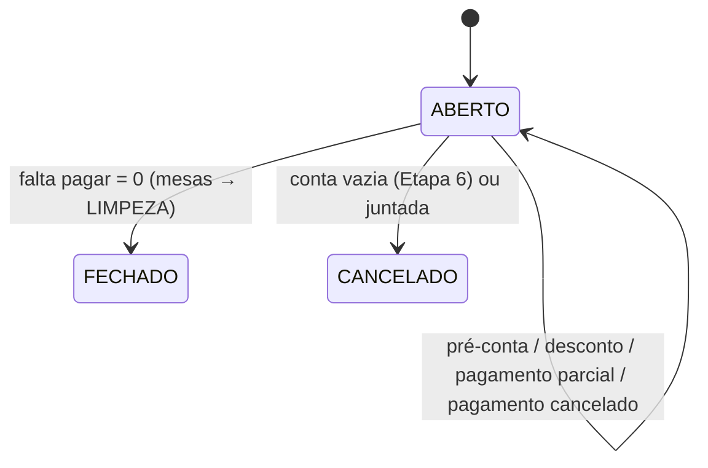

# POS (PDV) — Especificação (SDD)

> Status: Aprovado — Etapa: 8 — Responsável: domain-spec
> Decisões: README B.7.4, Q-06, Q-07, Q-17, E8-1, E8-3, E8-4 (docs/requirements/perguntas-abertas.md),
> ADR-0003 (dinheiro), ADR-0008 (transações), ADR-0009 (isolamento), ADR-0010 (impressão)

## 1. Objetivo
Fechar a conta: mostrar quanto o cliente deve (itens, descontos, taxa de serviço), emitir a
pré-conta, aplicar descontos com limite por perfil, receber um ou vários pagamentos — inclusive
conta dividida — e, quando tudo estiver pago, fechar a conta e liberar a mesa para limpeza. Cada
pagamento é registrado **uma única vez**, mesmo com a internet caindo no meio.

## 2. Atores
CAIXA, GERENTE, ADMIN (receber — E8-1). GERENTE autoriza com PIN o que passa do limite do caixa.

## 3. Regras de negócio

### Valores da conta
- **RN-POS-01** — Tudo na **loja ativa** (ADR-0009): conta, item ou pagamento de outra loja =
  "não encontrado".
- **RN-POS-02** — Valores em centavos inteiros, arredondamento half-up uma vez no fim (ADR-0003):
  - **itens** = Σ (preço + adicionais) × quantidade dos itens não cancelados;
  - **descontos nos itens** = Σ desconto de cada item;
  - **subtotal** = itens − descontos nos itens;
  - **desconto na conta**;
  - **base da taxa** = subtotal − desconto na conta;
  - **taxa de serviço** = base × percentual da conta (Q-06: **depois dos descontos**, sobre
    todos os produtos); conta de **balcão não tem taxa** (Q-06);
  - **total** = base + taxa; **pago** = Σ pagamentos ativos; **falta pagar** = total − pago.
- **RN-POS-03** — O percentual da taxa é **congelado na abertura da conta** (como o preço do item):
  mesa = taxa da loja naquele momento; balcão = 0%. Mudar a taxa da loja não altera contas abertas.

### Pré-conta
- **RN-POS-04** — **Pré-conta** (`payments.create`): conta aberta, sem itens não enviados
  (`PENDING_ITEMS`). Imprime pelo navegador em 80 mm (ADR-0010) com itens, descontos, taxa, total e
  **"NÃO É DOCUMENTO FISCAL"**. A mesa vai para **EM_PAGAMENTO**. Auditoria `PRE_BILL_ISSUED`.

### Descontos e taxa
- **RN-POS-05** — **Desconto** no item ou na conta, em valor (R$) ou percentual, com motivo (3 a 200).
  O desconto **substitui** o anterior; zero retira. Não passa do valor-base (linha do item ou
  subtotal). Limite por perfil (Q-07): a **soma** dos descontos da conta (itens + conta) sobre o valor
  dos itens não pode passar do limite do usuário na loja (decisão S-2 da revisão, 2026-10-05: o
  caixa não chega a ~19% somando 10% no item e 10% na conta); diminuir a soma é sempre livre para
  quem tem `discounts.apply`. Limites (GARÇOM 0%, CAIXA 10%, GERENTE/ADMIN 100% — `role.max_discount_bp`);
  quem não tem `discounts.apply` precisa SEMPRE do gerente — inclusive para **retirar** um desconto
  (achado B-1 da revisão). Acima do limite: `discounts.apply_above_limit` ou
  **PIN do gerente** no aparelho (autorização elevada). Auditoria `DISCOUNT_APPLIED` (quem pediu,
  quem autorizou, antes e depois).
- **RN-POS-06** — **Retirar a taxa de serviço** (e devolver): `discounts.apply_above_limit` ou PIN
  do gerente, com motivo. Auditoria `SERVICE_FEE_REMOVED` / `SERVICE_FEE_RESTORED`.
- **RN-POS-07** — Desconto e taxa só mudam **antes do primeiro pagamento** (`PAYMENTS_STARTED`):
  mudar depois deixaria pagamentos maiores que a conta. Para corrigir, cancele os pagamentos.

### Pagamentos
- **RN-POS-08** — **Receber** (`payments.create`, E8-1): conta ABERTA, sem itens não enviados, com
  **caixa aberto neste terminal** (`CASH_NOT_OPEN` — docs/modules/cashier.md). Formas: `DINHEIRO`,
  `PIX`, `CARTAO_CREDITO`, `CARTAO_DEBITO`, `OUTRO`. PIX e cartão são **confirmados à mão** pelo
  caixa (porta `PaymentProvider`, implementação manual — pronta para PSP/TEF depois); referência
  opcional (NSU, código do PIX). Valor > 0.
- **RN-POS-09** — **Troco só no dinheiro**: em dinheiro o caixa informa o **recebido**; se passar do
  que falta, o pagamento registrado é o que faltava e a diferença é o **troco**. Nas outras formas o
  valor não pode passar do que falta (`PAYMENT_EXCEEDS_BALANCE`).
- **RN-POS-10** — **Idempotência**: todo pagamento leva uma chave gerada no aparelho
  (`idempotencyKey`); reenviar a mesma chave devolve o pagamento original sem criar outro nem mexer
  no caixa (cenário do README B.4).
- **RN-POS-11** — Cada pagamento gera, na mesma transação, a movimentação `VENDA` no caixa aberto do
  terminal e soma no **pago** da conta. O primeiro pagamento leva a mesa a **EM_PAGAMENTO**.
- **RN-POS-12** — **Conta paga** (falta pagar = 0): fecha sozinha — situação **FECHADO**, valores
  congelados (itens, descontos, taxa, total), quem e quando; as mesas vão para **LIMPEZA** (o garçom
  libera depois — RN-TAB-05). Auditoria `PAYMENT_CREATED` e `ORDER_CLOSED`.
- **RN-POS-12a** — **Conta sem valor** (cortesia de 100% ou tudo cancelado): "Fechar conta sem
  valor" fecha sem pagamento e manda a mesa para limpeza; com valor a pagar → `BILL_NOT_FREE`;
  sem item com valor (conta vazia ou toda cancelada) → `BILL_EMPTY`, cancela-se na comanda
  (achado I-2 e S-1 da reverificação).
- **RN-POS-13** — **Divisão de conta** (README B.7.4):
  - **por valor**: o caixa digita quanto cada um paga (vários pagamentos);
  - **por pessoas**: a tela divide o que falta em N partes iguais — os centavos que sobram vão para
    as primeiras (`Money.allocate`) — e preenche o valor de cada pagamento;
  - **por itens**: o caixa marca os itens; o valor sugerido é a parte deles na conta (linha com
    desconto do item, proporcional ao desconto da conta, mais a taxa), e os itens ficam **marcados
    como pagos** (`payment_allocation`) — não podem ser escolhidos de novo. Se os itens marcados são
    **todos** os que faltam, cobra exatamente o que falta (sem sobrar centavo, mesmo depois de um
    pagamento por valor); se não, a parte deles não pode passar do que falta
    (`ITEMS_EXCEED_BALANCE` — achado I-1).
- **RN-POS-14** — **Cancelar pagamento** (E8-3): `payments.cancel` ou PIN do gerente, com motivo;
  só com a conta ABERTA e o caixa daquele pagamento **ainda aberto** (`CASH_SESSION_CLOSED`). Gera
  `ESTORNO` no caixa, tira do pago e libera os itens marcados. Auditoria `PAYMENT_CANCELLED`.
  Reabrir conta fechada fica para depois do piloto (E8-4).

### Relação com a comanda
- **RN-POS-15** — Com pagamento na conta, a comanda **não cancela item** nem **junta** a conta com
  outra (`PAYMENTS_STARTED`) — o total ficaria menor que o pago. Lançar mais itens continua
  permitido (o que falta pagar aumenta) e eles entram na próxima pré-conta.
- **RN-POS-16** — Concorrência: receber, descontar, emitir pré-conta e cancelar pagamento **travam a
  conta como primeira leitura** (ADR-0008) e depois o caixa e as mesas. Dois caixas recebendo a
  mesma conta: o segundo vê o pago atualizado (pode receber `PAYMENT_EXCEEDS_BALANCE` ou
  `ORDER_NOT_OPEN` se a conta já fechou).

## 4. Entidades
| Entidade | Atributos | Invariantes |
|---|---|---|
| Order (do Orders) | + service_fee_bp, service_fee_waived, discount_cents, discount_reason, paid_cents, prebill_at, totais congelados no fechamento (items, discounts, service_fee, total) | pago ≤ total enquanto aberta |
| OrderItem (do Orders) | + discount_cents, discount_reason | 0 ≤ desconto ≤ linha |
| Payment | store, order, cash_session, method, amount, tendered?, change?, reference?, status (`ATIVO`, `CANCELADO`), created_by/at, cancel (by/at/reason/authorized_by), version | valor > 0; troco só em dinheiro |
| PaymentAllocation | payment, order_item, amount | um item só em um pagamento ativo |

## 5. Estados

Mesa: `OCUPADA/AGUARDANDO_CONTA → EM_PAGAMENTO` (pré-conta ou 1º pagamento) → `LIMPEZA` (conta paga).

## 6. Exceções
| Situação | Código | HTTP | Mensagem |
|---|---|---|---|
| Itens não enviados | `PENDING_ITEMS` | 422 | Envie ou remova os itens ainda não enviados. |
| Conta não está aberta | `ORDER_NOT_OPEN` | 422 | Esta conta não está mais aberta. |
| Já há pagamento | `PAYMENTS_STARTED` | 422 | Esta conta já tem pagamento. Cancele os pagamentos antes. |
| Valor acima do que falta | `PAYMENT_EXCEEDS_BALANCE` | 422 | O valor passa do que falta pagar. |
| Dinheiro recebido menor que zero / inválido | `INVALID_PAYMENT_AMOUNT` | 400 | Informe um valor válido (ex.: 50,00). |
| Item já pago na divisão | `ITEM_ALREADY_PAID` | 422 | Um dos itens já foi pago em outra parte. |
| Itens marcados passam do que falta | `ITEMS_EXCEED_BALANCE` | 422 | Os itens marcados passam do que falta pagar. Receba por valor. |
| Dinheiro menor que a parte dos itens | `TENDERED_TOO_LOW` | 422 | O dinheiro recebido é menor que a parte destes itens. |
| Nada a pagar | `NOTHING_TO_PAY` | 422 | Esta conta não tem valor a pagar. |
| Fechar sem valor com valor a pagar | `BILL_NOT_FREE` | 422 | Esta conta tem valor a pagar. |
| Desconto maior que a base | `DISCOUNT_TOO_HIGH` | 422 | O desconto passa do valor. |
| Desconto acima do limite sem autorização | `FORBIDDEN` (com `elevationAllowed`) | 403 | Você não tem permissão para esta ação. |
| Motivo obrigatório | `DISCOUNT_REASON_REQUIRED` / `CANCEL_REASON_REQUIRED` | 400 | Explique o motivo (3 a 200 caracteres). |
| Balcão não tem taxa | `NO_SERVICE_FEE` | 422 | Pedido de balcão não tem taxa de serviço. |
| Pagamento já cancelado | `PAYMENT_ALREADY_CANCELLED` | 422 | Este pagamento já foi cancelado. |
| Caixa do pagamento fechado | `CASH_SESSION_CLOSED` | 409 | O caixa deste pagamento já foi fechado. |
| Chave reutilizada em outro comando | `IDEMPOTENCY_KEY_REUSED` | 409 | Esta chave já foi usada em outra operação. Recarregue a tela e tente novamente. |

## 7. Permissões
| Ação | Permissão | Autorização elevada? |
|---|---|---|
| Ver contas a receber e a conta | `payments.create` ou `cashier.read` | — |
| Pré-conta, receber | `payments.create` | — |
| Desconto até o limite do perfil | `discounts.apply` | acima: `discounts.apply_above_limit` (PIN) |
| Retirar/devolver a taxa | `discounts.apply_above_limit` | sim (PIN) |
| Cancelar pagamento | `payments.cancel` | sim (PIN) |

## 8. Contratos
| Ação | Entrada | Saída | Auditoria |
|---|---|---|---|
| `pos.receivables` | — | contas abertas da loja com total, pago e falta pagar | — |
| `pos.bill` | `{ orderId }` | conta com itens, descontos, taxa, total, pago, pagamentos | — |
| `pos.preBill` | `{ orderId }` | conta (para imprimir) | `PRE_BILL_ISSUED` |
| `pos.discountItem` / `pos.discountOrder` | `{ itemId \| orderId, mode: VALOR \| PERCENTUAL, value, reason, grantToken? }` | ok | `DISCOUNT_APPLIED` |
| `pos.serviceFee` | `{ orderId, waived, reason, grantToken? }` | ok | `SERVICE_FEE_REMOVED/RESTORED` |
| `pos.pay` | `{ orderId, method, amount, reference?, itemIds?, idempotencyKey }` | `{ paymentId, amount, change, closed }` | `PAYMENT_CREATED` (+ `ORDER_CLOSED`) |
| `pos.cancelPayment` | `{ orderId, paymentId, reason, grantToken?, idempotencyKey }` | ok | `PAYMENT_CANCELLED` |
| `pos.closeFree` | `{ orderId }` | ok | `ORDER_CLOSED` |

## 9. Modelo de dados (migration 0011)
`customer_order` + colunas da conta (§4) com CHECKs; `order_item` + desconto (CK ≤ linha);
`payment` (IX (order_id, status); IX cash_session_id; CK valor > 0; CK troco só em dinheiro);
`payment_allocation` (PK (payment_id, order_item_id); IX order_item_id).

## 10. Critérios de aceite
- **CA-POS-01** — Conta com taxa de 10% depois do desconto; balcão sem taxa → `tests/features/pos/conta.feature`
- **CA-POS-02** — Pagamento misto (PIX + dinheiro com troco) fecha a conta e manda a mesa para limpeza → `pagamento.feature`
- **CA-POS-03** — Reenvio do mesmo pagamento não duplica (README B.4) → `pagamento.feature`
- **CA-POS-04** — Sem caixa aberto não recebe → `pagamento.feature`
- **CA-POS-05** — Desconto acima do limite pede PIN do gerente → `conta.feature`
- **CA-POS-06** — Divisão por pessoas e por itens → `divisao.feature`
- **CA-POS-07** — Cancelar pagamento com PIN volta o valor e estorna o caixa → `pagamento.feature`
- **CA-POS-08** — Dois caixas recebendo a mesma conta; isolamento entre lojas (conta, desconto, pré-conta, taxa, cancelar pagamento) → `tests/integration/modules/pos/pos-rules.test.ts`
- **CA-POS-09** — Sem `discounts.apply` não retira desconto; pagar por valor e depois por itens; conta sem valor fecha → `pos-rules.test.ts`

## 11. Dependências
Orders (API na transação: travar a conta, itens, gravar descontos/taxa/pago, fechar a conta e as
mesas), Cashier (caixa aberto do terminal, venda, estorno), Authorization (limite de desconto,
autorização elevada), Users (nomes), Audit. Orders **não** depende de POS (a comanda consulta o
`paid_cents` da própria conta — RN-POS-15).

## 12. Fora do escopo
Reabrir conta fechada (E8-4), couvert/consumação/entrega (Q-17), NFC-e (P2), integração PIX/TEF (P2),
gorjeta separada da taxa, cancelar parte da quantidade do item.
