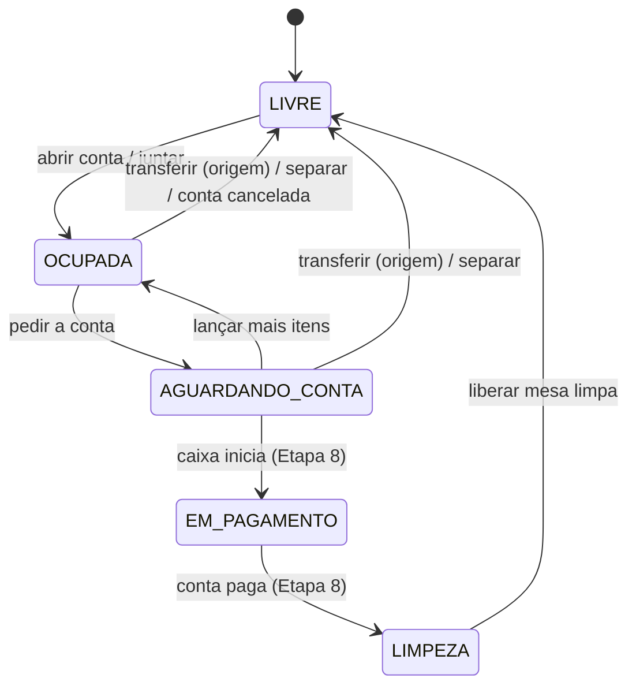

# Tables — Especificação (SDD)

> Status: Aprovado — Etapa: 6 — Responsável: domain-spec
> Decisões: README B.7.2, Q-04, Q-18, E6-2, E6-7 (docs/requirements/perguntas-abertas.md),
> ADR-0008 (versão), ADR-0009 (isolamento)

## 1. Objetivo
Cadastrar as mesas de cada loja e mostrar, no mapa do salão, em que situação cada uma está. As
mudanças de situação acontecem pela conta (módulo Orders); aqui ficam o cadastro, a máquina de
estados e a liberação depois da limpeza.

## 2. Atores
GERENTE/ADMIN (cadastro), GARÇOM/CAIXA/GERENTE (mapa, liberar mesa limpa).

## 3. Regras de negócio
- **RN-TAB-01** — Toda leitura e alteração fica na **loja ativa**. Mesa de outra loja responde
  "não encontrada" (`TABLE_NOT_FOUND`).
- **RN-TAB-02** — Cadastro (`tables.configure`, E6-2): **número** de 1 a 10 caracteres (letras,
  números, espaço e hífen: "10", "V1", "Varanda 2"), único na loja sem diferenciar maiúsculas e
  acentos; **área** opcional (até 40 caracteres, ex.: "Salão", "Varanda"); **lugares** de 1 a 99
  (padrão 4). Mesa nunca é apagada: é desativada.
- **RN-TAB-03** — Só se desativa (ou troca o número de) mesa **LIVRE** — o número está no rótulo da
  conta aberta (sugestão S-5 da revisão). Mesa desativada some do mapa e não pode ser
  aberta; o histórico das contas continua.
- **RN-TAB-04** — Estados: `LIVRE → OCUPADA → AGUARDANDO_CONTA → EM_PAGAMENTO → LIMPEZA → LIVRE`.
  `AGUARDANDO_CONTA → OCUPADA` é permitido (cliente pediu mais algo), com auditoria. Abrir,
  pedir conta, transferir, juntar e cancelar a conta são ações da conta (docs/modules/orders.md);
  `EM_PAGAMENTO` e a ida para `LIMPEZA` chegam com o PDV (Etapa 8).
- **RN-TAB-05** — **Liberar mesa limpa** (`tables.manage`): `LIMPEZA → LIVRE`. Em outro estado,
  `TABLE_NOT_IN_CLEANING`.
- **RN-TAB-06** — Uma mesa tem **no máximo uma conta aberta** (coluna `current_order_id`). Mesas
  juntadas apontam para a **mesma** conta e mudam de estado juntas.
- **RN-TAB-07** — Mapa: mesas **ativas** da loja, agrupadas por área e em ordem "natural" de
  número (2 antes de 10), com estado em **texto e cor**, lugares e, se ocupada, número da conta,
  subtotal, hora de abertura e mesas juntas. Atualiza sozinho a cada 5 s (ADR-0005).
- **RN-TAB-08** — Alterar o cadastro usa a versão lida (`CONCURRENT_MODIFICATION`); mudanças de
  estado travam a linha da mesa e também incrementam a versão.

## 4. Entidades
| Entidade | Atributos | Invariantes |
|---|---|---|
| DiningTable | store, number, area?, seats, status, current_order?, active, version | número único na loja; conta só em estado ≠ LIVRE/LIMPEZA |

## 5. Estados

## 6. Exceções
| Situação | Código | HTTP | Mensagem |
|---|---|---|---|
| Número inválido | `INVALID_TABLE_NUMBER` | 400 | Use de 1 a 10 letras ou números (ex.: 10, V1). |
| Área inválida | `INVALID_TABLE_AREA` | 400 | A área tem até 40 caracteres. |
| Lugares inválidos | `INVALID_SEATS` | 400 | Informe de 1 a 99 lugares. |
| Número repetido | `TABLE_NUMBER_TAKEN` | 409 | Já existe uma mesa com este número nesta loja. |
| Desativar mesa em uso | `TABLE_IN_USE` | 422 | Só dá para desativar uma mesa livre. |
| Trocar o número de mesa em uso | `TABLE_IN_USE` | 422 | Só dá para trocar o número de uma mesa livre. |
| Mesa inexistente ou de outra loja | `TABLE_NOT_FOUND` | 404 | Mesa não encontrada. |
| Liberar mesa que não está em limpeza | `TABLE_NOT_IN_CLEANING` | 422 | Esta mesa não está em limpeza. |
| Outra pessoa alterou antes | `CONCURRENT_MODIFICATION` | 409 | Outra pessoa alterou estes dados. Recarregue a página e tente de novo. |
| Loja trocada em outra aba | `STORE_CHANGED` | 409 | A loja mudou em outra aba. Recarregue a página e confira antes de salvar. |

## 7. Permissões
| Ação | Permissão |
|---|---|
| Ver o mapa | `tables.read` (ADMIN, GERENTE, CAIXA, GARÇOM) |
| Cadastrar/alterar/desativar mesa | `tables.configure` (ADMIN, GERENTE — nova, E6-2) |
| Liberar mesa limpa | `tables.manage` (ADMIN, GERENTE, CAIXA, GARÇOM) |

## 8. Contratos
| Ação | Entrada | Saída | Auditoria |
|---|---|---|---|
| `tables.list` (cadastro) | `{ includeInactive? }` | mesas da loja | — |
| `tables.create` | `{ number, area?, seats }` | `{ id }` | `TABLE_CREATED` |
| `tables.update` | `{ tableId, version, number, area?, seats, active }` | ok | `TABLE_UPDATED` |
| `tables.release` | `{ tableId }` | ok | `TABLE_STATUS_CHANGED` |
| Público (Orders) | `lockTables`, `findTable`, `setStatus`, `occupy`, `listActiveTables` na transação de quem chama | — | — |

## 9. Modelo de dados (migration 0008)
`dining_table` (id, store_id, number VARCHAR(10), area VARCHAR(40) NULL, seats TINYINT, status ENUM,
current_order_id NULL, active, version, timestamps) — UQ (store_id, number); IX (store_id, status);
IX current_order_id; CK seats 1–99; CK conta só com mesa ocupada.

## 10. Critérios de aceite
- **CA-TAB-01** — Gerente cadastra mesa; número repetido é recusado → `tests/features/tables/mesas.feature`
- **CA-TAB-02** — Garçom não cadastra mesa → `mesas.feature`
- **CA-TAB-03** — Mesa ocupada não é desativada → `mesas.feature`
- **CA-TAB-04** — Mesa em limpeza é liberada → `mesas.feature`
- **CA-TAB-05** — Mesa de outra loja não aparece nem é alterada → `tests/integration/modules/tables/tables-rules.test.ts`

## 11. Dependências
Organizations (loja ativa), Audit. Orders usa a API pública (a mesa não conhece a conta).

## 12. Fora do escopo
Desenho livre do salão (arrastar mesas), reserva, fila de espera, QR na mesa (P1).
