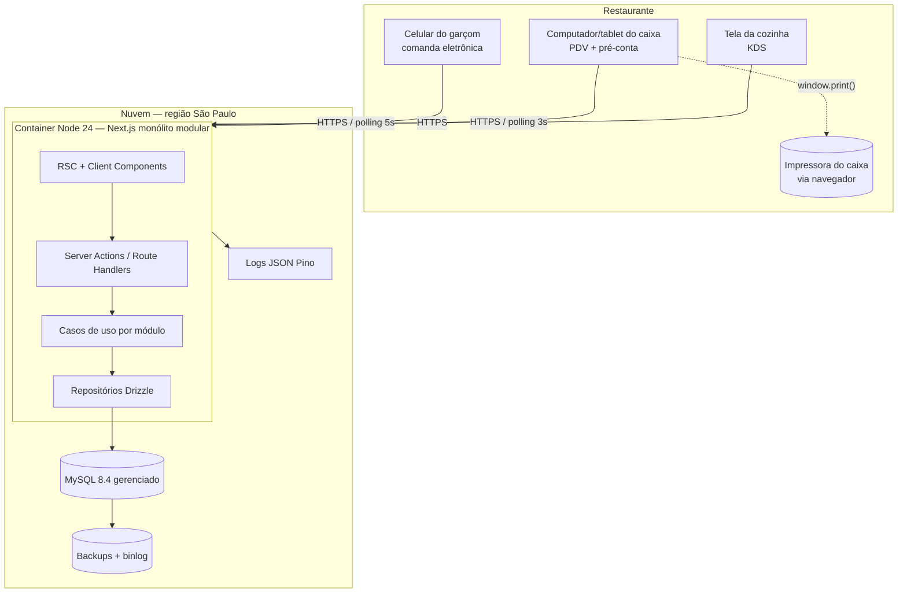
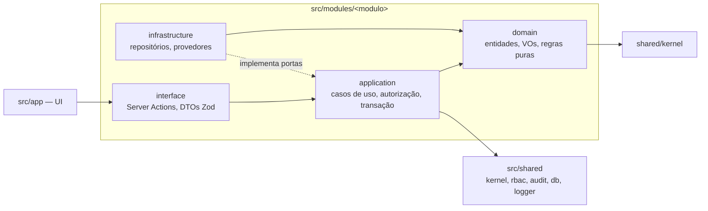
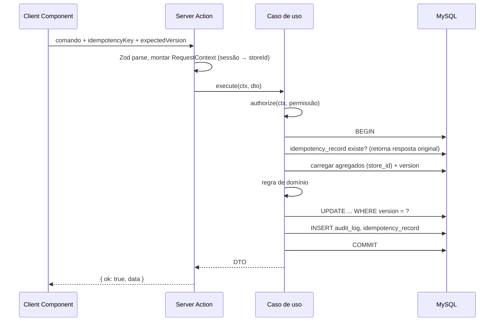

# Arquitetura do sistema

## Visão de implantação

```mermaid
flowchart TB
  subgraph Restaurante
    G[Celular do garçom<br/>comanda eletrônica]
    C[Computador/tablet do caixa<br/>PDV + pré-conta]
    K[Tela da cozinha<br/>KDS]
    P[(Impressora do caixa<br/>via navegador)]
    C -. "window.print()" .-> P
  end

  subgraph Nuvem_Sao_Paulo[Nuvem — região São Paulo]
    subgraph App[Container Node 24 — Next.js monólito modular]
      UI[RSC + Client Components]
      SA[Server Actions / Route Handlers]
      UC[Casos de uso por módulo]
      INF[Repositórios Drizzle]
      UI --> SA --> UC --> INF
    end
    DB[(MySQL 8.4 gerenciado)]
    BK[(Backups + binlog)]
    INF --> DB
    DB --> BK
    LOG[Logs JSON Pino]
    App --> LOG
  end

  G -- HTTPS / polling 5s --> App
  C -- HTTPS --> App
  K -- HTTPS / polling 3s --> App
```

## Camadas de um módulo

```mermaid
flowchart LR
  subgraph modulo[src/modules/&lt;modulo&gt;]
    I[interface<br/>Server Actions, DTOs Zod] --> A[application<br/>casos de uso, autorização, transação]
    A --> D[domain<br/>entidades, VOs, regras puras]
    INFRA[infrastructure<br/>repositórios, provedores] --> D
    INFRA -. implementa portas .-> A
  end
  APP[src/app — UI] --> I
  A --> SH[src/shared<br/>kernel, rbac, audit, db, logger]
  D --> K[shared/kernel]
```

## Pipeline de uma requisição de escrita

```mermaid
sequenceDiagram
  participant UI as Client Component
  participant SA as Server Action
  participant UC as Caso de uso
  participant DB as MySQL
  UI->>SA: comando + idempotencyKey + expectedVersion
  SA->>SA: Zod parse, montar RequestContext (sessão → storeId)
  SA->>UC: execute(ctx, dto)
  UC->>UC: authorize(ctx, permissão)
  UC->>DB: BEGIN
  UC->>DB: idempotency_record existe? (retorna resposta original)
  UC->>DB: carregar agregados (store_id) + version
  UC->>UC: regra de domínio
  UC->>DB: UPDATE ... WHERE version = ?
  UC->>DB: INSERT audit_log, idempotency_record
  UC->>DB: COMMIT
  UC-->>SA: DTO
  SA-->>UI: { ok: true, data }
```
