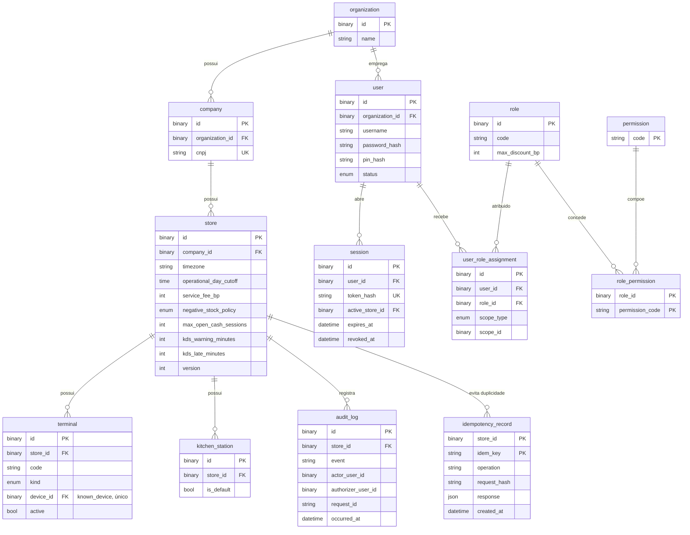
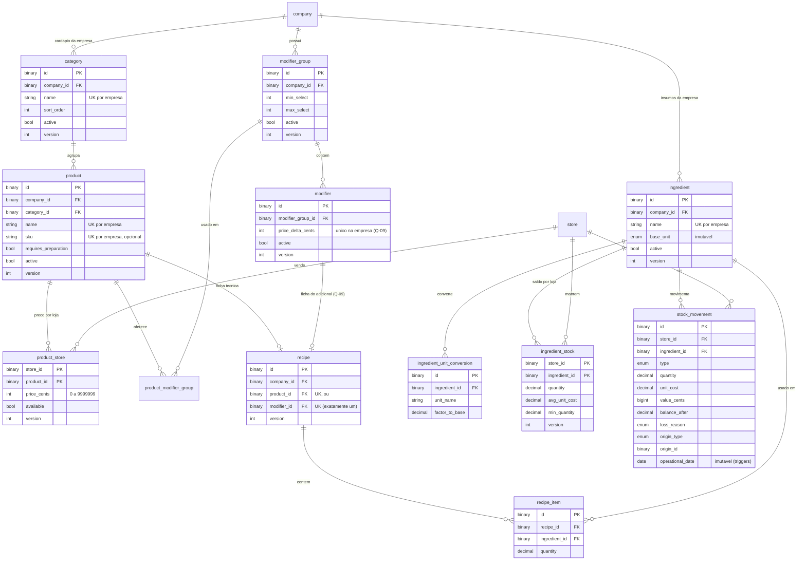
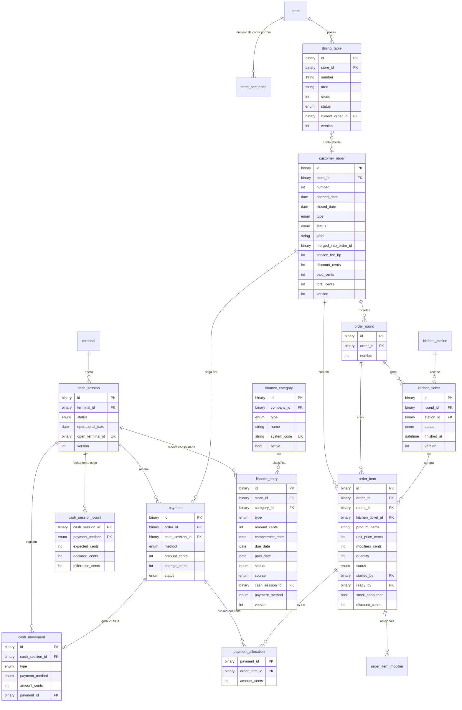

# ERD do MVP

Detalhe de colunas, índices e constraints: [docs/database/modelo-de-dados.md](../../docs/database/modelo-de-dados.md).
Diagrama dividido por área para legibilidade. PKs `id` são UUIDv7 `BINARY(16)`.

Tabelas já criadas por migration:
- Etapa 1: `idempotency_record` (FK para `store` adicionada na Etapa 3).
- Etapa 2: `organization`, `company`, `store` (mínimo), `app_user` (nome físico do "user"),
  `user_session`, `known_device`, `device_user`, `rate_limit_bucket`, `role`, `permission`,
  `role_permission`, `user_role_assignment`, `elevated_grant`, `audit_log` (com triggers de imutabilidade).
- Etapa 3: `terminal`, `kitchen_station`; configurações em `store`; `version` em `company`.
- Etapa 4: `category`, `product`, `product_store`, `modifier_group`, `modifier`,
  `product_modifier_group` (migration 0005 — docs/modules/catalog.md §9).
- Etapa 5: `ingredient`, `ingredient_unit_conversion`, `ingredient_stock`, `stock_movement`
  (imutável), `recipe`, `recipe_item` (migration 0006 — docs/modules/inventory.md, recipes.md).

As demais são o modelo planejado. Nomes da Etapa 2 prevalecem sobre o diagrama abaixo
(ex.: `session` → `user_session`; `terminal.device_id` → `known_device`).

## Organização, acesso e auditoria

## Catálogo, estoque e ficha técnica

## Salão, pedidos, cozinha, caixa, pagamentos e financeiro

