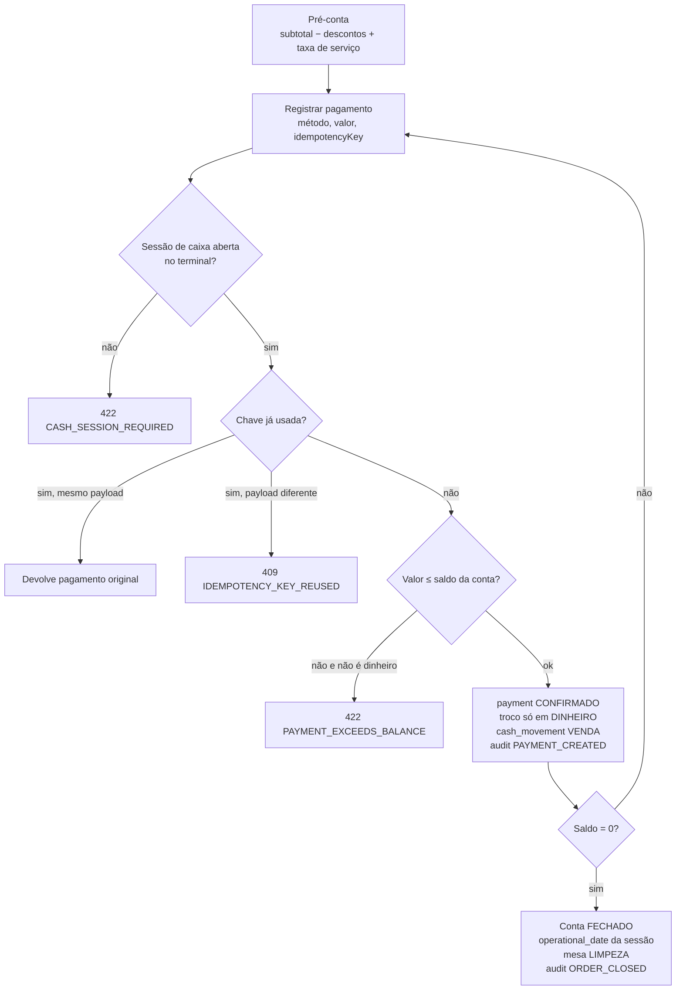
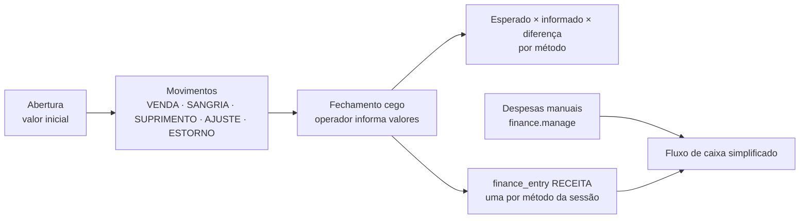

# Caixa, pagamentos e financeiro

## Pagamento de uma conta

## Sessão de caixa e financeiro

Esperado em dinheiro = abertura + VENDA(dinheiro, líquido de troco) + SUPRIMENTO − SANGRIA ± AJUSTE − ESTORNO(dinheiro).
