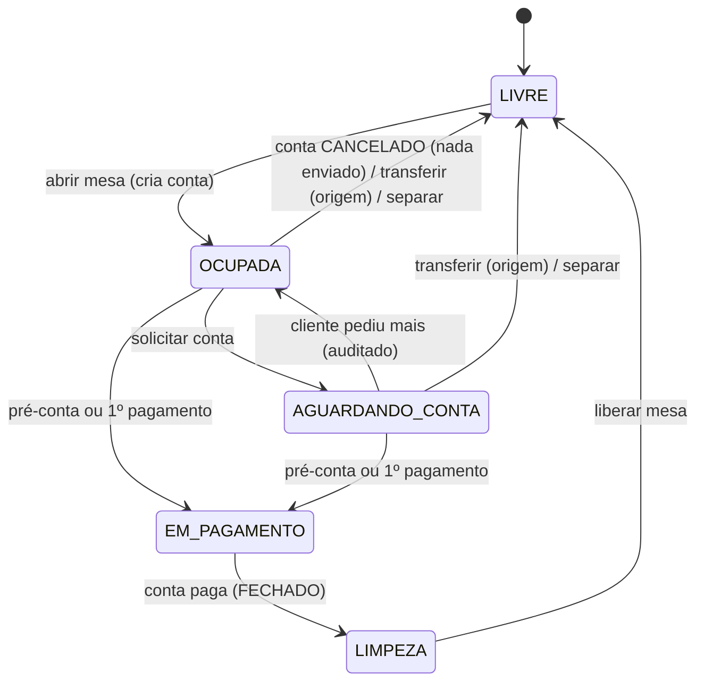
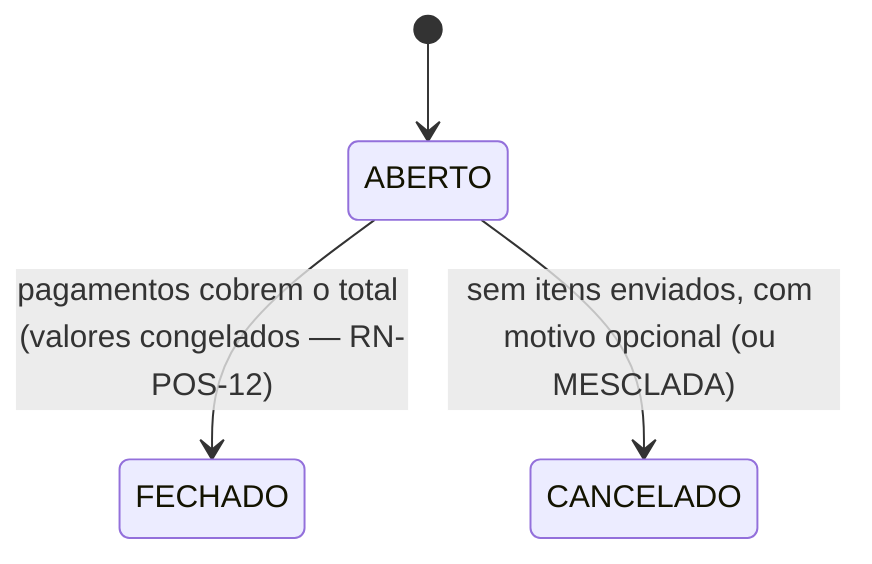
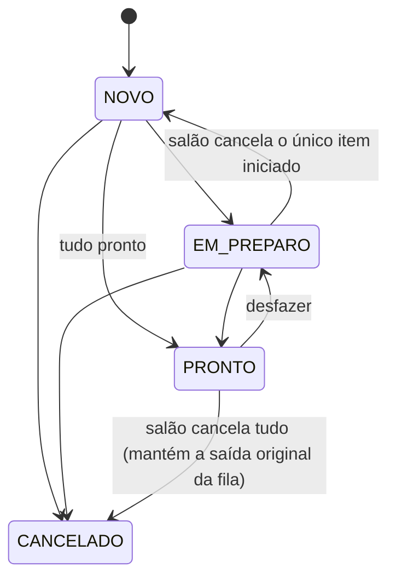
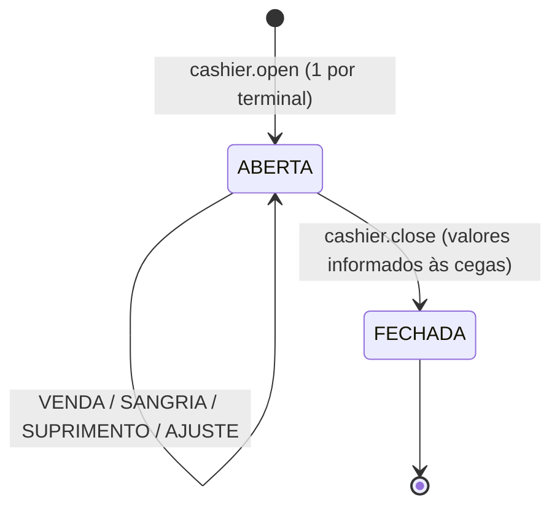
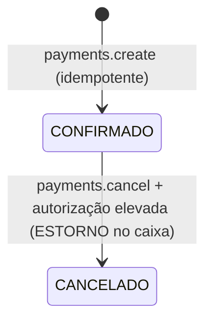

# Máquinas de estado

## Mesa (`dining_table.status`)

Implementado na Etapa 6 (docs/modules/tables.md, orders.md); `EM_PAGAMENTO` e `LIMPEZA` vêm do
PDV (Etapa 8 — docs/modules/pos.md). Pagamento cancelado não volta a mesa de `EM_PAGAMENTO`. Transferir: a conta vai para a mesa destino (`LIVRE`), que assume o estado da
origem; origem → `LIVRE`. Juntar: a mesa passa a apontar para a conta de destino; se tinha conta,
itens, rodadas (renumeradas) e tickets são movidos e a conta dela fica `CANCELADO` (`MESCLADA`);
todas as mesas da conta → `OCUPADA`. Separar: a mesa sai de uma conta com outras mesas → `LIVRE`.

## Conta (`customer_order.status`)

Reabrir conta fechada: ação sensível do README, adiada para depois do piloto (E8-4). Até lá,
correção de pagamento é feita ANTES do fechamento, cancelando o pagamento (RN-POS-14).

## Pagamento (`payment.status`)

```mermaid
stateDiagram-v2
  [*] --> ATIVO: receber (idempotente; movimentação VENDA no caixa)
  ATIVO --> CANCELADO: payments.cancel ou PIN + motivo, conta aberta e caixa aberto (ESTORNO)
```

## Item (`order_item.status`)

```mermaid
stateDiagram-v2
  [*] --> PENDENTE: lançado
  PENDENTE --> [*]: removido (orders.update, sem auditoria de cancelamento)
  PENDENTE --> ENVIADO: rodada enviada
  ENVIADO --> EM_PREPARO: cozinha inicia
  ENVIADO --> PRONTO: cozinha marca pronto (sem iniciar) / tudo pronto
  EM_PREPARO --> PRONTO: cozinha marca pronto
  PRONTO --> EM_PREPARO: cozinha desfaz, antes de entregar (E7-2, auditado)
  PRONTO --> ENTREGUE: garçom entrega
  PENDENTE --> PRONTO: rodada enviada, item sem preparo (Q-08)
  ENVIADO --> CANCELADO: orders.cancel ou PIN do gerente + motivo (estorno)
  EM_PREPARO --> CANCELADO: orders.cancel ou PIN do gerente + motivo (perda)
  PRONTO --> CANCELADO: orders.cancel ou PIN do gerente + motivo (perda; estorno se sem preparo)
  ENTREGUE --> CANCELADO: orders.cancel ou PIN do gerente + motivo (perda)
```

## Ticket de cozinha (`kitchen_ticket.status`)

Calculado dos itens não cancelados (RN-KDS-06, Etapa 7): `NOVO` (todos `ENVIADO`),
`EM_PREPARO` (algum começou ou ficou pronto), `PRONTO` (todos prontos/entregues), `CANCELADO`
(todos cancelados). `PRONTO` e `CANCELADO` gravam `finished_at` (saída da fila).

## Sessão de caixa (`cash_session.status`)

## Pagamento (`payment.status`)

