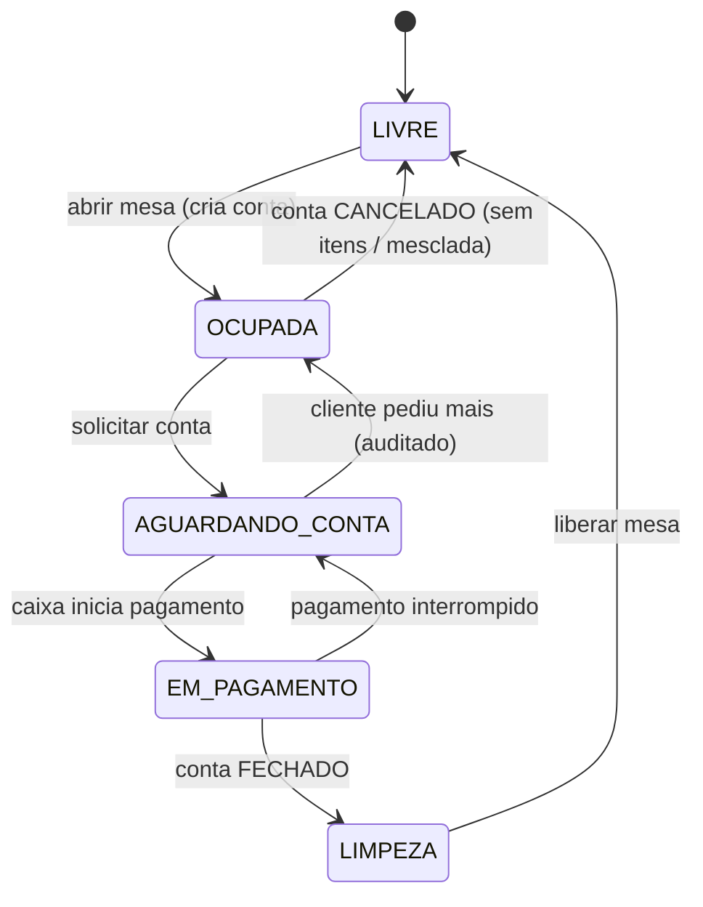
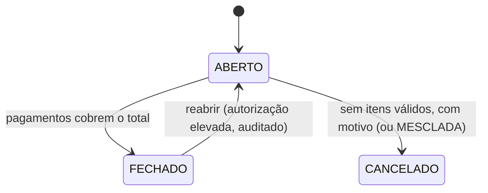
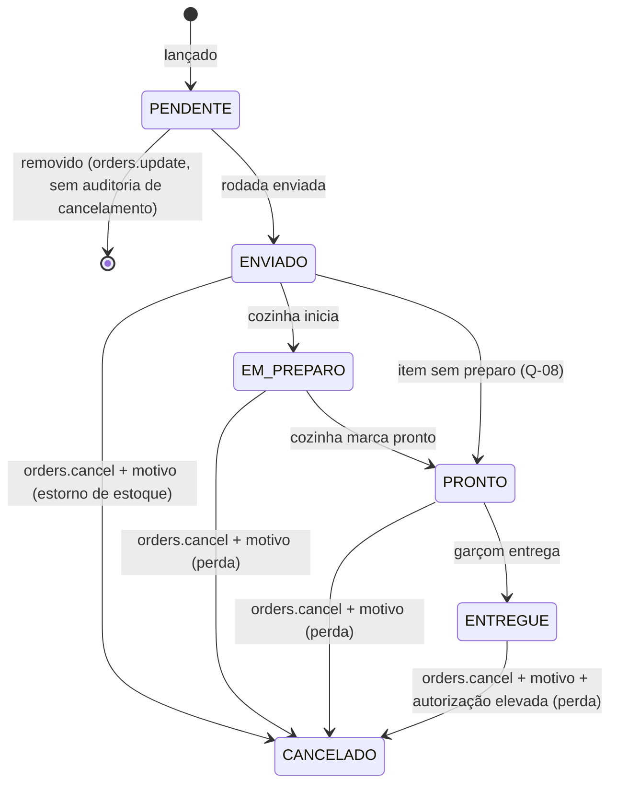
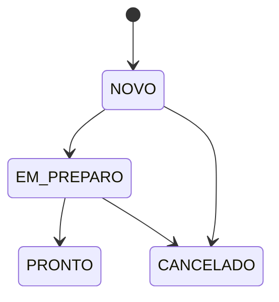
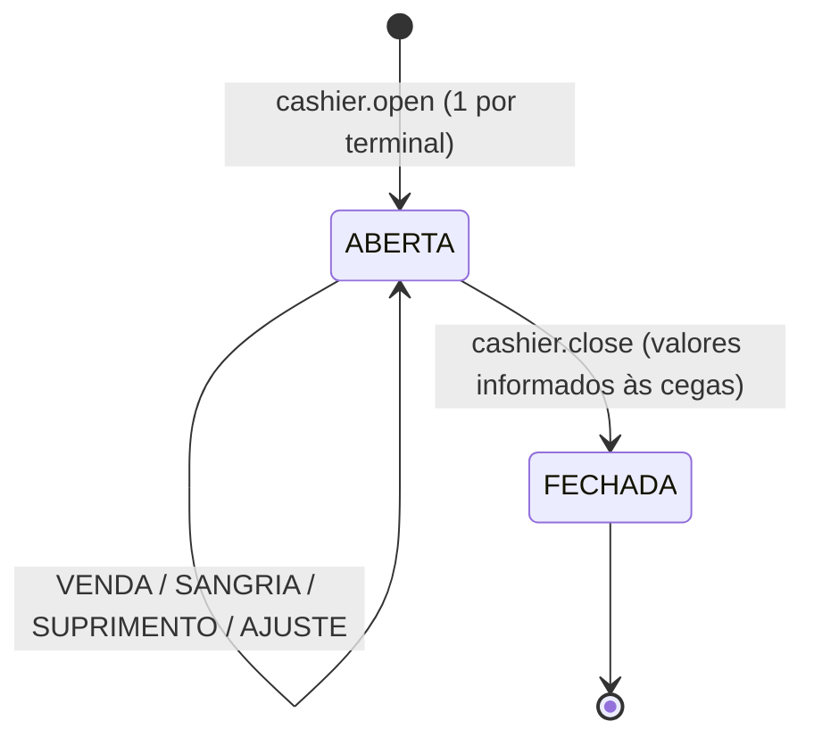
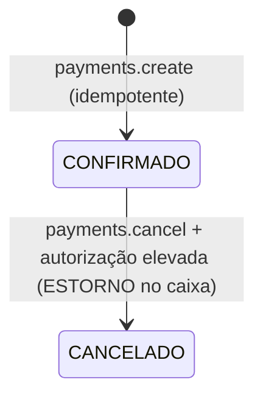

# Máquinas de estado

## Mesa (`dining_table.status`)

Transferir: conta aberta vai da mesa origem para a destino (`LIVRE`); origem → `LIVRE`.
Juntar: mesa origem passa a apontar para a conta da mesa destino; itens movidos.

## Conta (`customer_order.status`)

Reabrir conta: previsto no README como ação sensível; exige cancelar pagamentos antes ou
manter saldo — detalhar no SDD de Payments (Etapa 8).

## Item (`order_item.status`)

## Ticket de cozinha (`kitchen_ticket.status`)

Derivado dos itens: `NOVO` (todos `ENVIADO`) → `EM_PREPARO` (algum em preparo) → `PRONTO`
(todos prontos/entregues/cancelados) ; `CANCELADO` (todos cancelados).

## Sessão de caixa (`cash_session.status`)

## Pagamento (`payment.status`)

