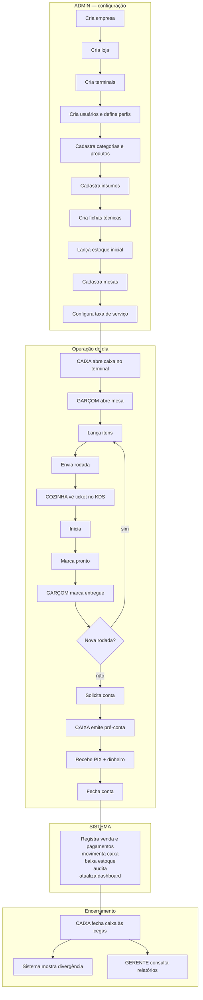
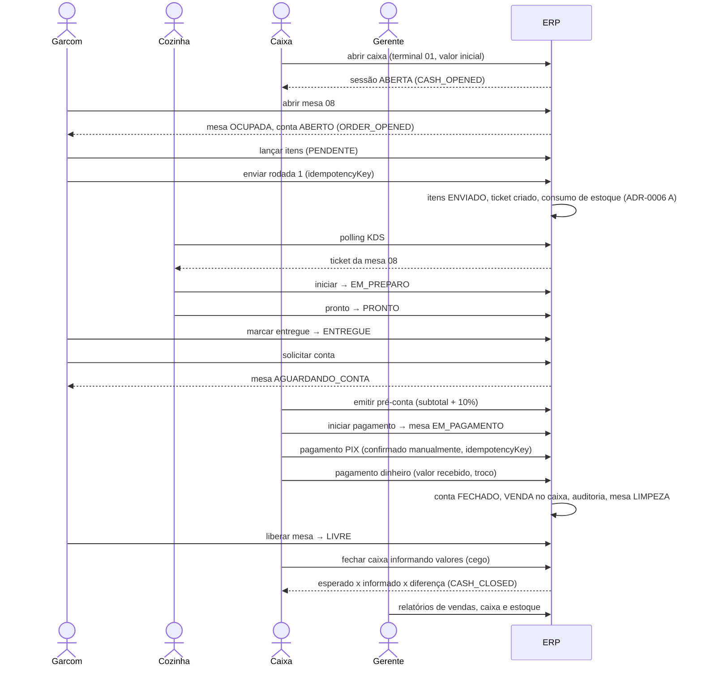

# Golden path do MVP

Validado de ponta a ponta sem intervenção manual no banco (E2E na Etapa 10).

## Visão por fases

```mermaid
flowchart TD
  subgraph Configuracao[ADMIN — configuração]
    A1[Cria empresa] --> A2[Cria loja] --> A3[Cria terminais] --> A4[Cria usuários e define perfis]
    A4 --> A5[Cadastra categorias e produtos] --> A6[Cadastra insumos] --> A7[Cria fichas técnicas]
    A7 --> A8[Lança estoque inicial] --> A9[Cadastra mesas] --> A10[Configura taxa de serviço]
  end
  subgraph Operacao[Operação do dia]
    C1[CAIXA abre caixa no terminal]
    G1[GARÇOM abre mesa] --> G2[Lança itens] --> G3[Envia rodada]
    K1[COZINHA vê ticket no KDS] --> K2[Inicia] --> K3[Marca pronto]
    G4[GARÇOM marca entregue] --> G5{Nova rodada?}
    G5 -- sim --> G2
    G5 -- não --> G6[Solicita conta]
    C2[CAIXA emite pré-conta] --> C3[Recebe PIX + dinheiro] --> C4[Fecha conta]
  end
  subgraph Sistema[SISTEMA]
    S1[Registra venda e pagamentos<br/>movimenta caixa<br/>baixa estoque<br/>audita<br/>atualiza dashboard]
  end
  subgraph Encerramento
    C5[CAIXA fecha caixa às cegas] --> C6[Sistema mostra divergência]
    M1[GERENTE consulta relatórios]
  end

  A10 --> C1 --> G1
  G3 --> K1
  K3 --> G4
  G6 --> C2
  C4 --> S1 --> C5 --> M1
```

## Sequência da operação

```mermaid
sequenceDiagram
  actor Garcom
  actor Cozinha
  actor Caixa
  actor Gerente
  participant ERP

  Caixa->>ERP: abrir caixa (terminal 01, valor inicial)
  ERP-->>Caixa: sessão ABERTA (CASH_OPENED)
  Garcom->>ERP: abrir mesa 08
  ERP-->>Garcom: mesa OCUPADA, conta ABERTO (ORDER_OPENED)
  Garcom->>ERP: lançar itens (PENDENTE)
  Garcom->>ERP: enviar rodada 1 (idempotencyKey)
  ERP->>ERP: itens ENVIADO, ticket criado, consumo de estoque (ADR-0006 A)
  Cozinha->>ERP: polling KDS
  ERP-->>Cozinha: ticket da mesa 08
  Cozinha->>ERP: iniciar → EM_PREPARO
  Cozinha->>ERP: pronto → PRONTO
  Garcom->>ERP: marcar entregue → ENTREGUE
  Garcom->>ERP: solicitar conta
  ERP-->>Garcom: mesa AGUARDANDO_CONTA
  Caixa->>ERP: emitir pré-conta (subtotal + 10%)
  Caixa->>ERP: iniciar pagamento → mesa EM_PAGAMENTO
  Caixa->>ERP: pagamento PIX (confirmado manualmente, idempotencyKey)
  Caixa->>ERP: pagamento dinheiro (valor recebido, troco)
  ERP->>ERP: conta FECHADO, VENDA no caixa, auditoria, mesa LIMPEZA
  Garcom->>ERP: liberar mesa → LIVRE
  Caixa->>ERP: fechar caixa informando valores (cego)
  ERP-->>Caixa: esperado x informado x diferença (CASH_CLOSED)
  Gerente->>ERP: relatórios de vendas, caixa e estoque
```
