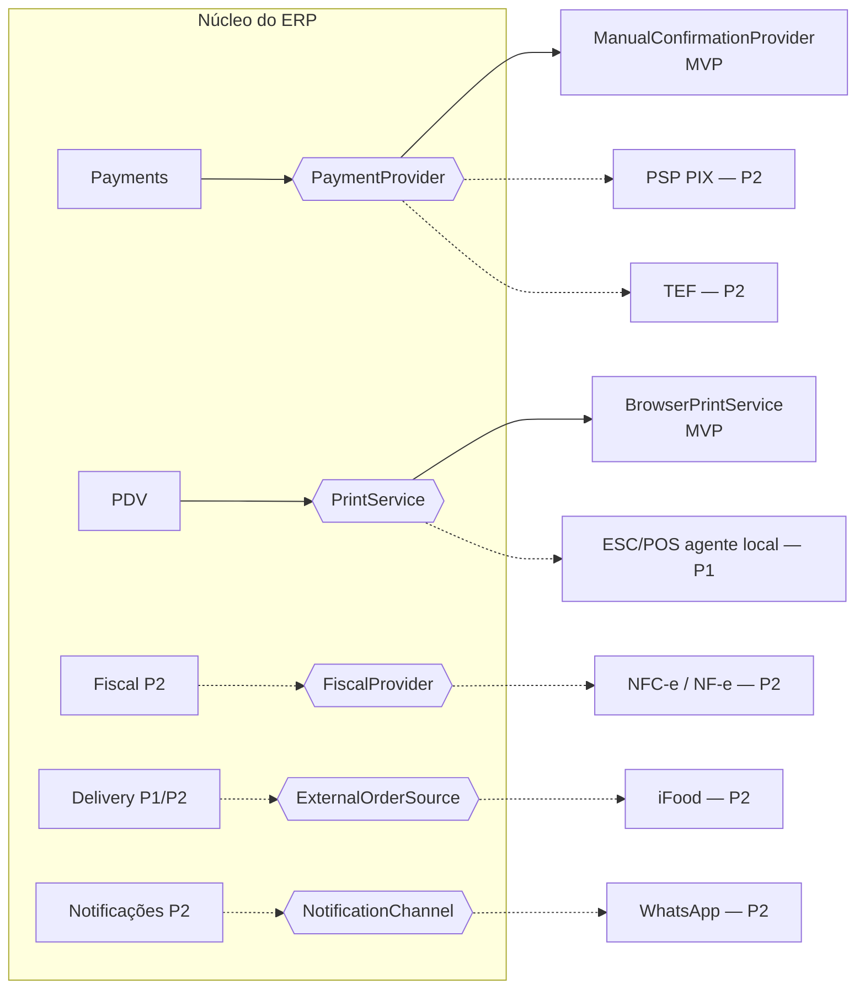

# Integrações — portas e implementações

Detalhes: [docs/integrations/integracoes-futuras.md](../../docs/integrations/integracoes-futuras.md).

Linhas sólidas = existe no MVP. Tracejadas = futuro (entra com ADR próprio; integrações assíncronas trazem o padrão outbox).
