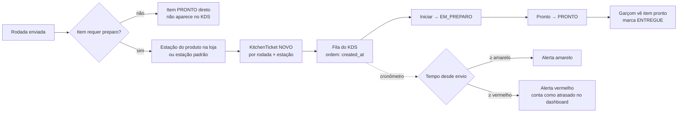

# Fluxo do KDS

- Polling a cada 3 s com cursor `since` (ADR-0005).
- Cronômetro calculado no cliente a partir de `sent_at` do servidor (sem relógio do dispositivo como verdade: offset corrigido pela resposta do servidor).
- Limiares de alerta configuráveis por loja (Q-14).
- Item cancelado sai da fila e aparece riscado por 30 s para a cozinha perceber.
- Modelo pronto para várias praças: `product_store.station_id` + `kitchen_ticket.station_id`.
