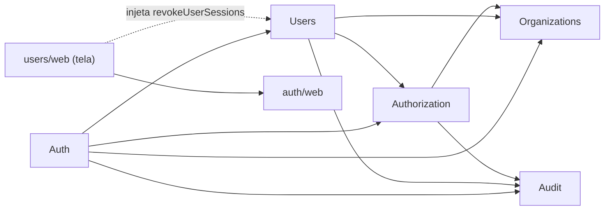
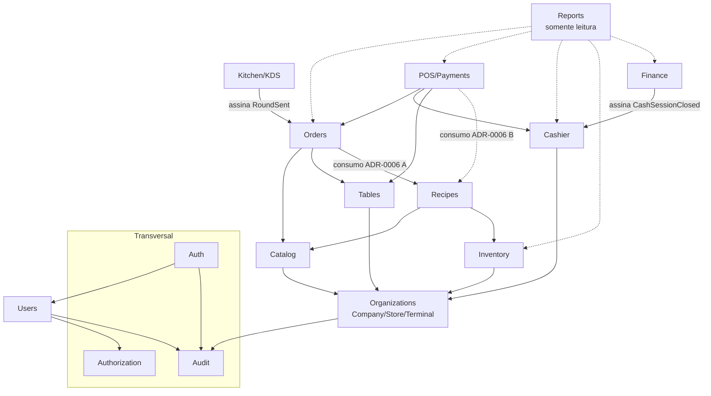

# Dependências entre módulos

Seta `A --> B` = A chama caso de uso público de B ou assina evento de B. Nenhum módulo acessa
tabelas de outro. Ciclos são proibidos (verificado no lint).

## Implementado (Etapa 2 — ADR-0014)

Portas públicas: `@/modules/<m>` (núcleo, sem Next) e `@/modules/<m>/web` (adaptadores Next).

## Planejado (MVP completo)

Todos os módulos de negócio dependem de **Authorization** (autorização no caso de uso) e
**Audit** (registro de eventos); essas setas foram omitidas por legibilidade.

## Eventos de domínio (síncronos, na mesma transação — ADR-0008)

| Evento | Publicado por | Assinado por |
|---|---|---|
| `RoundSent` | Orders | Kitchen (cria tickets), Recipes/Inventory (consumo, se ADR-0006 = A) |
| `OrderItemCancelled` | Orders | Kitchen (remove da fila), Inventory (estorno ou perda) |
| `KitchenItemStatusChanged` | Kitchen | Orders (atualiza status do item) |
| `PaymentRegistered` | Payments | Cashier (`VENDA`), Orders (saldo da conta) |
| `OrderClosed` | Payments/Orders | Tables (`LIMPEZA`), Inventory (consumo, se ADR-0006 = B) |
| `CashSessionClosed` | Cashier | Finance (receitas por método) |

Reports lê por **query services** próprios (somente leitura), única exceção documentada à
regra de não ler dados de outro módulo — sem escrita, sem regra de negócio.
