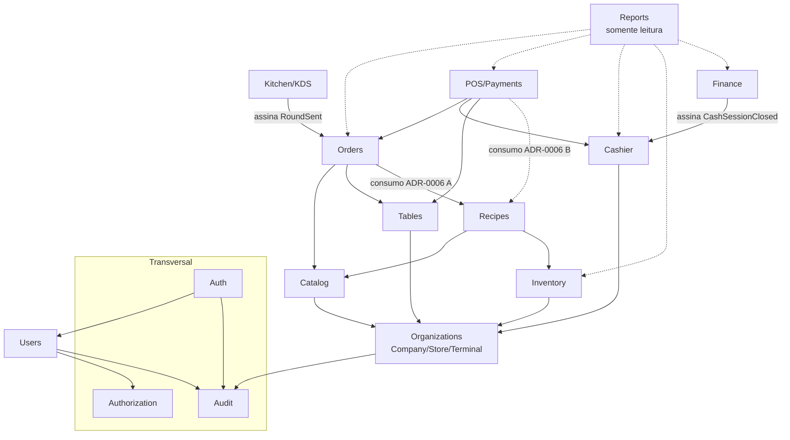

# Dependências entre módulos

Seta `A --> B` = A chama caso de uso público de B ou assina evento de B. Nenhum módulo acessa
tabelas de outro. Ciclos são proibidos (verificado no lint).

## Implementado (Etapas 2 a 5 — ADR-0014)

```mermaid
flowchart LR
  REC[Recipes] --> CAT
  REC --> INV[Inventory]
  REC --> ORG
  REC --> AUDIT
  INV --> ORG
  INV --> USERS
  INV --> AUDIT
  CAT[Catalog] --> ORG
  CAT --> AUTHZ
  CAT --> AUDIT
  AUTH[Auth] --> USERS[Users]
  AUTH --> AUTHZ[Authorization]
  AUTH --> ORG[Organizations]
  USERS --> AUTHZ
  USERS --> ORG
  AUTHZ --> ORG
  AUTH --> AUDIT[Audit]
  USERS --> AUDIT
  AUTHZ --> AUDIT
  ORG --> AUDIT
  USERSWEB["users/web (tela)"] -. injeta revokeUserSessions .-> USERS
  USERSWEB --> AUTHWEB["auth/web"]
  ORGWEB["organizations/web (tela)"] -. injeta storeAccess .-> ORG
  ORGWEB --> AUTHZ
  ORGWEB --> AUTHWEB
```

Portas públicas: `@/modules/<m>` (núcleo, sem Next) e `@/modules/<m>/web` (adaptadores Next).
Na Etapa 3, Organizations precisa consultar permissões por escopo, mas Authorization já depende de
Organizations: a consulta (`StoreAccess`) é **injetada** pela camada web, como na Etapa 2.
Na Etapa 4, Catalog usa Organizations (loja ativa → empresa; lojas da empresa) e Authorization
(`products.update` em cada loja do preço) **diretamente**: nenhum dos dois depende do Catalog, então
não há ciclo e não é preciso injetar.
Na Etapa 5, Inventory usa Organizations (loja → empresa; política de estoque negativo, fuso e
virada) e Users (nome de quem fez cada movimentação); Recipes usa Catalog (produtos, adicionais,
preço na loja), Inventory (custo médio e **baixa por venda**) e Organizations. A comanda (Etapa 6)
chamará `recipes.consumeForItems` e `inventory.reverseConsumption`/`consumptionToLoss` na própria
transação (ADR-0006 A).

## Planejado (MVP completo)

Todos os módulos de negócio dependem de **Authorization** (autorização no caso de uso) e
**Audit** (registro de eventos); essas setas foram omitidas por legibilidade.

## Eventos de domínio (síncronos, na mesma transação — ADR-0008)

| Evento | Publicado por | Assinado por |
|---|---|---|
| `RoundSent` | Orders | Kitchen (cria tickets), Recipes/Inventory (consumo, se ADR-0006 = A) |
| `OrderItemCancelled` | Orders | Kitchen (remove da fila), Inventory (estorno ou perda) |
| `KitchenItemStatusChanged` | Kitchen | Orders (atualiza status do item) |
| `PaymentRegistered` | Payments | Cashier (`VENDA`), Orders (saldo da conta) |
| `OrderClosed` | Payments/Orders | Tables (`LIMPEZA`), Inventory (consumo, se ADR-0006 = B) |
| `CashSessionClosed` | Cashier | Finance (receitas por método) |

Reports lê por **query services** próprios (somente leitura), única exceção documentada à
regra de não ler dados de outro módulo — sem escrita, sem regra de negócio.
