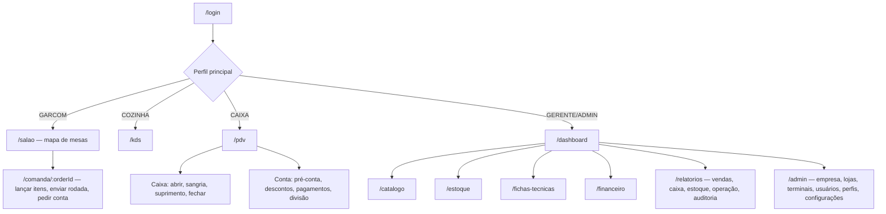

# Navegação

Menu lateral (E3-4, implementado na Etapa 3 — `src/app/(app)/sidebar.tsx`), filtrado pelas
permissões da loja ativa; o servidor bloqueia de novo em cada tela.

| Aparelho | Comportamento |
|---|---|
| Computador (≥ 1280 px) | Menu fixo à esquerda, aberto; botão "Recolher menu" deixa só os ícones (lembrado em cookie) |
| Tablet (768–1279 px) | Começa recolhido (só ícones); "Expandir menu" abre |
| Celular (< 768 px) | Barra no topo com ☰; o menu abre como gaveta (`<dialog>`: foco preso, Esc fecha) |

Estrutura: seletor de loja no topo (loja ativa + terminal do aparelho; troca em 1 clique —
RN-ORG-12) · grupos **Operação** (Início, Disponibilidade; depois Salão, KDS, PDV), **Cardápio**
(Produtos, Categorias, Adicionais — Etapa 4), **Estoque** (Estoque, Fichas técnicas — Etapa 5) e
**Administração** (Usuários, Empresa, Lojas,
Terminais) · rodapé com a conta (Meu PIN, Trocar senha, Trocar usuário, Sair).
Página atual com `aria-current="page"`. O KDS (Etapa 7) abrirá em tela cheia, sem menu.

Mapa de telas planejado (MVP):

| Tela | Dispositivo alvo | Permissão mínima |
|---|---|---|
| Mapa de mesas `/salao` e comanda `/salao/comanda/:id` (abrir, lançar, enviar, cancelar com PIN, pedir conta, transferir, juntar, separar, balcão) — Etapa 6 | Celular (Q-15) | tables.read, orders.read (lançar: orders.create; mexer na conta: orders.update; cancelar enviado: orders.cancel ou PIN do gerente) |
| Cadastro de mesas `/mesas`, `/mesas/:id` — Etapa 6 | Desktop/tablet | tables.configure (E6-2) |
| KDS | Tablet/monitor | kds.read |
| PDV | Desktop/tablet | cashier.read |
| Dashboard | Desktop | dashboard.read |
| Cardápio: `/catalogo/produtos`, `/catalogo/categorias`, `/catalogo/adicionais` (Etapa 4) | Desktop (funciona no celular) | products.update (cadastrar: products.create) |
| Disponibilidade `/disponibilidade` — "acabou"/"voltou" (Etapa 4) | Celular/tablet da cozinha ou do caixa | products.availability |
| Estoque `/estoque`, `/estoque/:id` (lançar, extrato, mínimo, unidades) — Etapa 5 | Desktop; contagem no celular | inventory.read (lançar: inventory.manage) |
| Fichas técnicas `/fichas-tecnicas`, `/fichas-tecnicas/produto/:id`, `/fichas-tecnicas/adicional/:id` — Etapa 5 | Desktop | recipes.read (salvar: recipes.manage) |
| Financeiro, relatórios | Desktop | finance.read / reports.read |
| Admin — usuários | Desktop | users.read |
| Admin — empresa e lojas (Etapa 3) | Desktop | stores.manage |
| Admin — terminais (Etapa 3) | No próprio aparelho | terminals.manage |
