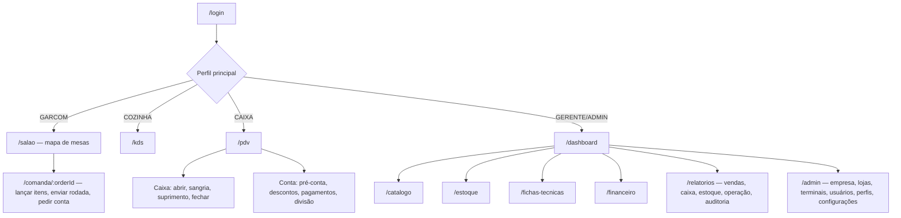

# Navegação (proposta)

Menu filtrado pelas permissões da loja ativa. Seletor de loja no topo (troca em 1 clique).

| Tela | Dispositivo alvo | Permissão mínima |
|---|---|---|
| Mapa de mesas / comanda | Celular | tables.read, orders.read |
| KDS | Tablet/monitor | kds.read |
| PDV | Desktop/tablet | cashier.read |
| Dashboard | Desktop | dashboard.read |
| Catálogo, estoque, fichas | Desktop | products.read / inventory.read / recipes.read |
| Financeiro, relatórios | Desktop | finance.read / reports.read |
| Admin | Desktop | users.read / stores.read |
