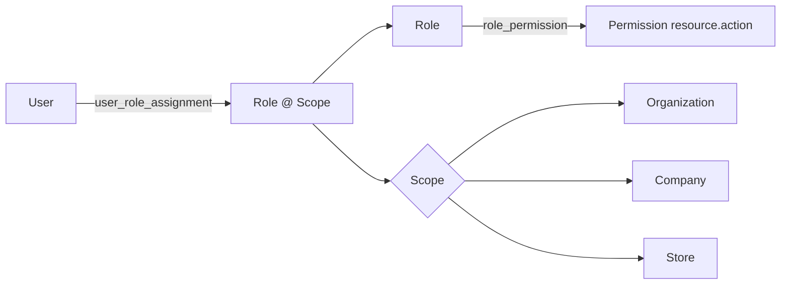

# Matriz de permissões do MVP (proposta)

Modelo: `Role → Permission (resource.action) → Scope (organization | company | store)`.
✅ = concedida · ⚡ = pode **solicitar**; executa com autorização elevada de quem tem a permissão.

| Permissão | ADMIN | GERENTE | CAIXA | GARCOM | COZINHA |
|---|---|---|---|---|---|
| dashboard.read | ✅ | ✅ | ✅ | | |
| users.read | ✅ | ✅ | | | |
| users.create / users.update / users.disable | ✅ | ✅ (anti-escalada) | | | |
| stores.read | ✅ | ✅ | ✅ | ✅ | ✅ |
| stores.manage | ✅ | | | | |
| products.read | ✅ | ✅ | ✅ | ✅ | ✅ |
| products.create / products.update | ✅ | ✅ | | | |
| tables.read | ✅ | ✅ | ✅ | ✅ | |
| tables.manage | ✅ | ✅ | ✅ | ✅ (liberar LIMPEZA) | |
| orders.read | ✅ | ✅ | ✅ | ✅ | |
| orders.create / orders.update | ✅ | ✅ | ✅ | ✅ | |
| orders.cancel | ✅ | ✅ | ⚡ | ⚡ | |
| kds.read | ✅ | ✅ | | ✅ | ✅ |
| kds.manage | ✅ | ✅ | | | ✅ |
| cashier.read | ✅ | ✅ | ✅ | | |
| cashier.open / cashier.close / cashier.movement | ✅ | ✅ | ✅ | | |
| payments.create | ✅ | ✅ | ✅ | | |
| payments.cancel | ✅ | ✅ | ⚡ | | |
| discounts.apply (até `max_discount_bp` do perfil) | ✅ | ✅ | ✅ | ⚡ | |
| discounts.apply_above_limit | ✅ | ✅ | ⚡ | ⚡ | |
| inventory.read | ✅ | ✅ | | | ✅ |
| inventory.manage | ✅ | ✅ | | | |
| recipes.read | ✅ | ✅ | | | ✅ |
| recipes.manage | ✅ | ✅ | | | |
| finance.read / finance.manage | ✅ | ✅ | | | |
| reports.read | ✅ | ✅ | | | |
| audit.read | ✅ | ✅ | | | |

Observações:
- `tables.manage` do GARCOM depende da Q-18/interpretação 2 (docs/requirements/perguntas-abertas.md).
- Remoção da taxa de serviço: `discounts.apply_above_limit` (proposta) + auditoria `SERVICE_FEE_REMOVED`.
- Reabrir conta: `payments.cancel` + autorização elevada.
- Anti-escalada: GERENTE não atribui `ADMIN` nem permissões que não possui.

