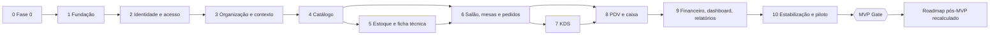

# Dependências entre etapas

```mermaid
flowchart LR
  E0[0 Fase 0] --> E1[1 Fundação]
  E1 --> E2[2 Identidade e acesso]
  E2 --> E3[3 Organização e contexto]
  E3 --> E4[4 Catálogo]
  E4 --> E5[5 Estoque e ficha técnica]
  E4 --> E6[6 Salão, mesas e pedidos]
  E5 --> E6
  E6 --> E7[7 KDS]
  E6 --> E8[8 PDV e caixa]
  E7 --> E8
  E8 --> E9[9 Financeiro, dashboard, relatórios]
  E9 --> E10[10 Estabilização e piloto]
  E10 --> GATE{{MVP Gate}}
  GATE --> POS[Roadmap pós-MVP recalculado]
```

## Pós-MVP (referência, sujeito ao piloto)

```mermaid
flowchart LR
  MVP[MVP] --> EST[Estabilização]
  EST --> DEL[Delivery / Cardápio digital]
  DEL --> COM[Compras]
  COM --> FIN[Financeiro completo]
  FIN --> FIS[Fiscal]
  FIS --> RH[RH]
  RH --> ML[Multi-loja avançado]
  ML --> AN[Analytics]
  AN --> IA[IA]
```
