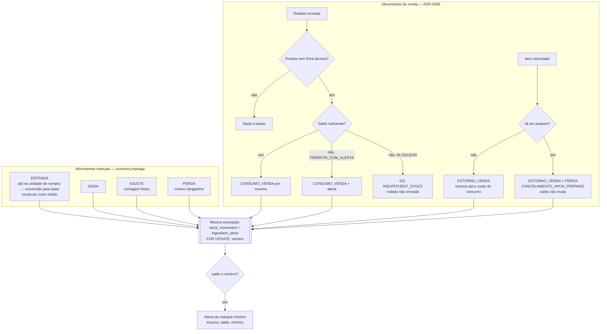

# Fluxo de estoque

## Custo

- Custo médio ponderado na ENTRADA: `novo_custo = (saldo × custo_atual + qtd × custo_entrada) / (saldo + qtd)`
  (saldo negativo tratado como zero no cálculo — E5-3, RN-INV-05; implementado na Etapa 5).
- Decisão Q-01 = **A** (ADR-0006 aceito): a baixa acontece no envio da rodada; as funções já
  existem e são testadas desde a Etapa 5 — a comanda (Etapa 6) passa a chamá-las.
- Custo teórico do produto = Σ (quantidade da ficha × custo médio do insumo).
- CMV do período = Σ custo dos movimentos `CONSUMO_VENDA` − `ESTORNO_VENDA` (e perdas reportadas à parte).
